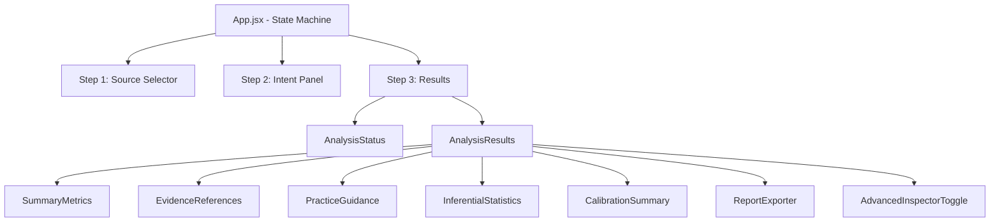

# Tessiture — Beginner Vocalist UX Improvement Plan

**Status:** Ready for implementation  
**Source:** UX/Usability review conducted 2026-03-22  
**Scope:** Frontend only (all changes in `frontend/src/`)  
**Goal:** Make Tessiture immediately usable and comprehensible for beginning vocalists with no prior knowledge of acoustic analysis

---

## Architecture Overview



---

## Phase 1 — Critical Fixes (P0)

These four changes have the highest impact-to-effort ratio and directly unblock basic usability for beginners.

---

### P0-1: Vocal Range Classification in `SummaryMetrics`

**Problem:** The app shows raw Hz values and note names but never tells the user what voice type they are. This is the single most actionable piece of information for a beginning vocalist.

**File:** [`frontend/src/components/SummaryMetrics.jsx`](../frontend/src/components/SummaryMetrics.jsx)

**Implementation:**

Add a `classifyVoiceType(f0MinHz, f0MaxHz)` utility function. Use standard MIDI-based voice type ranges:

| Voice Type | Low Note | Low MIDI | High Note | High MIDI |
|------------|----------|----------|-----------|-----------|
| Bass | E2 | 40 | E4 | 64 |
| Baritone | G2 | 43 | G4 | 67 |
| Tenor | C3 | 48 | C5 | 72 |
| Alto | F3 | 53 | F5 | 77 |
| Mezzo-Soprano | A3 | 57 | A5 | 81 |
| Soprano | C4 | 60 | C6 | 84 |

**Classification logic:** Convert `f0Min` and `f0Max` from Hz to MIDI using `69 + 12 * log2(f / 440)`. Score each voice type by how well the detected range overlaps with the canonical range. Return the best match plus a confidence label ("likely", "possibly").

**UI change:** Add a new `summary-list__item` row after the tessitura row:

```
Voice type: Likely Tenor
(Based on your detected range C3–B4)
```

Add a `summary-list__item--voice-type` modifier class for optional styling emphasis.

**New file to create:** `frontend/src/components/VoiceTypeClassifier.js` — pure utility, no JSX, exports `classifyVoiceType(f0MinHz, f0MaxHz)` returning `{ label, confidence, description }`.

**CSS:** Add `.summary-list__item--voice-type` with a subtle brand-colored left border to visually distinguish it as the "headline" result.

---

### P0-2: Glossary Tooltip System

**Problem:** 20+ technical terms appear in the UI with no explanation. A beginner sees "F0 (Hz)", "cents", "formant", "inferential statistics" and has no way to understand them without leaving the app.

**New file to create:** `frontend/src/components/GlossaryTerm.jsx`

**Component API:**
```jsx
<GlossaryTerm term="cents">
  pitch bias (cents)
</GlossaryTerm>
```

**Behavior:**
- Renders children as a `<button>` with `type="button"`, `aria-describedby` pointing to a tooltip `id`
- On hover (desktop) or tap (mobile), shows a small popover with the definition
- Popover is dismissible via Escape key or clicking outside
- Uses `role="tooltip"` and `id` for ARIA association
- Tooltip text is sourced from a static `GLOSSARY` object in the same file

**Glossary entries to include (minimum):**

| Term key | Display label | Definition |
|----------|---------------|------------|
| `tessitura` | Tessitura | The range of pitches where your voice is most comfortable and resonant — not your absolute highest or lowest note, but where you sing most naturally. |
| `f0` | F0 / Fundamental Frequency | The basic pitch of your voice, measured in Hz (cycles per second). Middle C is about 262 Hz. |
| `cents` | Cents | A unit for measuring tiny pitch differences. 100 cents = 1 semitone (one piano key). Being within ±25 cents is considered good tuning. |
| `formant` | Formant | Resonant frequencies in your vocal tract that give your voice its unique timbre (tone color). F1 and F2 are the two most important. |
| `vibrato` | Vibrato | A natural, regular wavering of pitch that adds warmth and expression to sustained notes. |
| `inferential_statistics` | Inferential Statistics | Mathematical tools that estimate how reliable a measurement is. They help distinguish real patterns from random variation. |
| `confidence_interval` | Confidence Interval | A range of values that likely contains the true measurement. A 95% CI means we are 95% sure the true value falls in this range. |
| `p_value` | p-value | A number between 0 and 1 indicating whether a difference is statistically meaningful. Values below 0.05 are typically considered significant. |
| `vocal_separation` | AI Vocal Separation | An AI process that isolates your voice from background music or instruments before analysis, improving accuracy. |
| `dtw` | DTW Alignment | Dynamic Time Warping — a technique that aligns two recordings even if they have slightly different tempos, for fair comparison. |
| `spectral_centroid` | Spectral Centroid | The "center of mass" of the sound's frequency content. A higher value means a brighter, more forward tone. |

**CSS:** Add `.glossary-term` (inline button, underline-dotted style), `.glossary-tooltip` (small popover card, `z-index: 100`, positioned above the term), and `.glossary-tooltip--visible` (opacity/transform transition).

**Integration points** (wrap existing text in these components):
- [`SummaryMetrics.jsx:33`](../frontend/src/components/SummaryMetrics.jsx:33) — "Lowest detected pitch (F0, Hz)"
- [`SummaryMetrics.jsx:37`](../frontend/src/components/SummaryMetrics.jsx:37) — "Highest detected pitch (F0, Hz)"
- [`SummaryMetrics.jsx:41`](../frontend/src/components/SummaryMetrics.jsx:41) — "Comfortable singing range (tessitura)"
- [`InferentialStatistics.jsx`](../frontend/src/components/InferentialStatistics.jsx) — "Inferential statistics" heading, "Confidence interval", "p-value"
- [`EvidenceReferences.jsx:77`](../frontend/src/components/EvidenceReferences.jsx:77) — section title (also rename, see P1-7)
- [`VocalSeparationStatus.jsx`](../frontend/src/components/VocalSeparationStatus.jsx) — "AI vocal extraction"

---

### P0-3: In-Browser SVG Pitch Range Visualization

**Problem:** `PianoRoll.jsx` and `PitchCurve.jsx` both explicitly defer all charts to PDF. The on-screen experience is entirely text-based. A beginner cannot visualize their range without downloading a PDF.

**New file to create:** `frontend/src/components/VocalRangeBar.jsx`

**Component API:**
```jsx
<VocalRangeBar
  f0MinHz={196}
  f0MaxHz={880}
  tessituraLow={220}
  tessituraHigh={660}
  f0MinNote="G3"
  f0MaxNote="A5"
/>
```

**Visual design:** A horizontal SVG bar spanning from the lowest to highest detected note, with:
- A light gray background bar representing the full human vocal range (E2–C6, MIDI 40–84)
- A brand-colored bar showing the user's detected range
- A slightly brighter/highlighted segment showing the tessitura band
- Note name labels at the low and high ends
- A small piano keyboard reference below the bar (optional, can be Phase 2)
- Voice type zone markers (Bass/Baritone/Tenor/Alto/Mezzo/Soprano) as subtle background bands

**Accessibility:** The SVG must have `role="img"` and `aria-label` describing the range in plain text (e.g., "Your vocal range spans from G3 to A5, with your comfortable tessitura between A3 and F5").

**Integration:** Add `<VocalRangeBar>` to [`SummaryMetrics.jsx`](../frontend/src/components/SummaryMetrics.jsx) below the `<dl>` list, before the closing `</section>`.

**CSS:** Add `.vocal-range-bar` wrapper with `overflow: visible`, responsive width, and `max-width: 600px`.

---

### P0-4: Human-Readable Analysis Status

**Problem:** [`AnalysisStatus.jsx`](../frontend/src/components/AnalysisStatus.jsx) shows raw developer state strings ("State: queued", "Stage: queued") and the raw job UUID to end users.

**File:** [`frontend/src/components/AnalysisStatus.jsx`](../frontend/src/components/AnalysisStatus.jsx)

**Changes:**

1. **Replace raw state display** with a `STATE_MESSAGES` map:

```js
const STATE_MESSAGES = {
  idle: "Ready to analyze",
  queued: "Waiting in queue…",
  processing: "Analyzing your recording…",
  completed: "Analysis complete!",
  failed: "Analysis failed",
  error: "Something went wrong",
};
```

2. **Replace raw stage display** with a `STAGE_MESSAGES` map:

```js
const STAGE_MESSAGES = {
  queued: "Waiting for an available slot…",
  preprocessing: "Preparing your audio…",
  pitch_estimation: "Detecting pitch…",
  tessitura_analysis: "Mapping your vocal range…",
  advanced_analysis: "Running advanced analysis…",
  comparison: "Comparing to reference…",
  reporting: "Generating your report…",
  completed: "Done!",
};
```

3. **Hide the raw job UUID** — move it to a collapsed `<details>` element labeled "Technical details (for support)" so it is accessible if needed but not shown by default.

4. **Remove the "State:" and "Stage:" `<dl>` rows** — replace with a single prominent status message using the maps above, styled with a larger font and appropriate color (brand for active, success for completed, danger for error).

5. **Add a status icon** (emoji or SVG): ⏳ for queued/processing, ✅ for completed, ❌ for error.

**CSS:** Add `.status__message` (large, centered, prominent) and `.status__technical` (small, muted, collapsed details).

---

## Phase 2 — High Impact (P1)

These changes significantly improve the experience but are less critical than Phase 1.

---

### P1-1: Visible Step Progress Indicator

**Problem:** The three workflow steps exist only in `aria-label` attributes — invisible to sighted users.

**File:** [`frontend/src/App.jsx`](../frontend/src/App.jsx)

**Implementation:** Add a `<StepIndicator>` component (new file `frontend/src/components/StepIndicator.jsx`) that renders above the source selector:

```
● Step 1: Choose source  →  ○ Step 2: Set up  →  ○ Step 3: Results
```

**Props:** `currentStep` (1, 2, or 3), `steps` (array of `{ label, description }`).

**State mapping:**
- Step 1 = always active initially; completed when `audioSource !== null`
- Step 2 = active when `audioSource !== null && analysisMode === null`; completed when `analysisMode !== null`
- Step 3 = active when `showStep3 === true`

**CSS:** `.step-indicator` (flex row), `.step-indicator__step` (circle + label), `.step-indicator__step--active` (brand color), `.step-indicator__step--completed` (success color with checkmark), `.step-indicator__connector` (line between steps).

**Responsive:** On mobile, show only the current step label (e.g., "Step 2 of 3: Set up") instead of all three.

---

### P1-2: Onboarding / Welcome Section

**Problem:** No explanation of what the app does, who it's for, or what to expect.

**File:** [`frontend/src/App.jsx`](../frontend/src/App.jsx)

**Implementation:** Add a collapsible `<WelcomePanel>` component (new file `frontend/src/components/WelcomePanel.jsx`) rendered between the `<header>` and the source selector. It should:

- Default to **open** on first visit (use `localStorage` key `tessiture_welcome_seen`)
- Auto-collapse after the user selects a source for the first time
- Be manually re-openable via a "?" help button in the app header

**Content:**
```
🎤 Welcome to Tessiture

Tessiture analyzes your singing voice and gives you plain-language feedback 
to help you improve. Here's what you can do:

🔬 Analyze your voice — Upload a recording to discover your vocal range, 
   comfortable tessitura, and personalized practice tips.

🎯 Compare to a reference — Sing along with a reference track and see how 
   closely your pitch and rhythm match.

🎵 Try a demo — Not sure where to start? Pick a demo track from the Example 
   Library — no upload needed.

[Get started →]  [Don't show again]
```

**CSS:** `.welcome-panel` (card style, brand-colored left border), `.welcome-panel__features` (3-column grid on desktop, stacked on mobile).

---

### P1-3: Rename and Explain the Spectrogram Inspector

**Problem:** The spectrogram is hidden in a `<details>` element labeled "Audio inspector" with no explanation of what it shows.

**File:** [`frontend/src/components/AnalysisResults.jsx`](../frontend/src/components/AnalysisResults.jsx) (the `AdvancedInspectorToggle` function at line 25)

**Changes:**
1. Rename summary text from `"Audio inspector"` to `"🔍 Audio spectrogram (advanced)"`
2. Add a description paragraph inside the `<details>` element, before `<SpectrogramInspector>`:
   ```
   This shows the frequency content of your recording over time. 
   The horizontal axis is time, the vertical axis is frequency (pitch), 
   and the white line is your detected pitch. Colored markers show key moments.
   Brighter colors mean louder frequencies.
   ```
3. Add `aria-describedby` on the `<details>` pointing to this description paragraph.

---

### P1-4: Fix Export Button Layout on Mobile

**Problem:** [`styles.css:817`](../frontend/src/styles.css:817) uses `flex-wrap: nowrap` on `.exporter__actions`, causing the three export buttons to overflow on narrow screens.

**File:** [`frontend/src/styles.css`](../frontend/src/styles.css)

**Change:** Set `.exporter__actions { flex-wrap: wrap; gap: var(--space-sm); }` and add a responsive rule:

```css
@media (max-width: 480px) {
  .exporter__actions {
    flex-direction: column;
  }
  .exporter__actions .button {
    width: 100%;
  }
}
```

---

### P1-5: Enable Audio Playback for Uploaded Files in EvidenceReferences

**Problem:** The "Jump to" and "Listen snippet" buttons in [`EvidenceReferences.jsx`](../frontend/src/components/EvidenceReferences.jsx) are disabled for uploaded files because `audioSourceUrl` is null. Only example tracks (served at `/examples/{filename}`) have a URL.

**Root cause:** [`App.jsx`](../frontend/src/App.jsx) passes `analysisAudioSourceUrl` which is only set for example tracks.

**Fix:**
1. In [`App.jsx`](../frontend/src/App.jsx), when `acceptedFile` is set, create an object URL: `const uploadedFileUrl = useMemo(() => acceptedFile ? URL.createObjectURL(acceptedFile) : null, [acceptedFile])` and revoke it on cleanup with `useEffect`.
2. Pass `uploadedFileUrl` as `audioSourceUrl` to `<AnalysisResults>` when the source is "upload".
3. Pass `acceptedFile.name` as `audioSourceLabel`.

**Note:** Object URLs are valid for the lifetime of the page session, so this works without any backend changes.

---

### P1-6: Explain PDF Export Contents

**Problem:** The PDF contains charts and visualizations not available on screen, but this is never communicated to the user.

**File:** [`frontend/src/components/ReportExporter.jsx`](../frontend/src/components/ReportExporter.jsx)

**Change:** Update the `card__meta` paragraph from:
```
"Download results in your preferred format."
```
to:
```
"Download results in your preferred format. The PDF report includes pitch curves, 
piano roll, and range visualizations not shown on this page."
```

Also add a visual emphasis on the PDF button (e.g., `button--primary` class or a ⭐ prefix) to draw attention to it as the richest format.

---

### P1-7: Rename "Evidence references" to Beginner-Friendly Label

**Problem:** "Evidence references" sounds academic/legal. Beginners don't know what it means.

**File:** [`frontend/src/components/EvidenceReferences.jsx`](../frontend/src/components/EvidenceReferences.jsx)

**Changes:**
1. Line 77: Change section title from `"Evidence references"` to `"Key moments in your recording"`
2. Line 78–80: Change meta text from `"Each diagnostic is linked to timestamped track moments so you can jump and listen without using charts."` to `"These are the most important moments in your recording — your highest and lowest notes. Click to jump to them or listen to a short clip."`
3. Line 98: Change fallback text from `"Audio playback is unavailable for this result. Use timestamp references to locate moments manually."` to `"Audio playback is not available for this result. The timestamps below show when these moments occur in your recording."`

---

## Phase 3 — Medium Impact (P2)

These changes improve quality of experience but are not blockers.

---

### P2-1: Live Mode Explanation

**File:** [`frontend/src/App.jsx`](../frontend/src/App.jsx) (line ~602)

**Change:** Expand the live mic mode note to:
```
Live mic mode — You will sing along with a reference track in real time. 
The app will show whether you are in tune and how closely your rhythm matches. 
Select a reference track below, then press Start Session.
For a full analysis of your voice (range, tessitura, practice tips), 
upload a recording after your session.
```

Remove the unexplained word "formant" from this note.

---

### P2-2: Touch Support on Spectrogram Inspector

**File:** [`frontend/src/components/SpectrogramInspector.jsx`](../frontend/src/components/SpectrogramInspector.jsx)

**Change:** Add `onTouchMove` and `onTouchStart` handlers to the canvas element that mirror the existing `onMouseMove` logic. Use `touch.clientX` / `touch.clientY` with `getBoundingClientRect()` to compute canvas-relative coordinates.

---

### P2-3: Screen-Reader Description for Spectrogram Canvas

**File:** [`frontend/src/components/SpectrogramInspector.jsx`](../frontend/src/components/SpectrogramInspector.jsx)

**Change:** Add a visually hidden `<p>` element with `id="spectrogram-description"` and set `aria-describedby="spectrogram-description"` on the canvas. The description should be computed from props:
```
"Spectrogram showing frequency content from [minFreq] Hz to [maxFreq] Hz 
over [duration] seconds. Detected pitch range: [f0MinNote] to [f0MaxNote]."
```

---

### P2-4: Hide Calibration Summary Behind "Advanced" Toggle

**File:** [`frontend/src/components/AnalysisResults.jsx`](../frontend/src/components/AnalysisResults.jsx)

**Change:** Rename the "Reference calibration" tab to "Advanced / Calibration" and add a brief explanation at the top of the `CalibrationSummary` panel:
```
These metrics describe the accuracy of the analysis engine itself, not your singing. 
They are intended for advanced users and researchers.
```

---

### P2-5: Specific File Size Limit in AudioUploader

**File:** [`frontend/src/components/AudioUploader.jsx`](../frontend/src/components/AudioUploader.jsx)

**Change:** Replace `"Max size depends on server settings"` with a value read from `import.meta.env.VITE_MAX_UPLOAD_MB` (default `"50"`):
```jsx
const maxMb = import.meta.env.VITE_MAX_UPLOAD_MB ?? "50";
// ...
<p className="uploader__hint">Max file size: {maxMb} MB. Supported formats: MP3, WAV, FLAC, OGG, M4A.</p>
```

Add `VITE_MAX_UPLOAD_MB=50` to [`.env.example`](../.env.example).

---

### P2-6: "Recommended for Beginners" Label on Example Library Card

**File:** [`frontend/src/App.jsx`](../frontend/src/App.jsx) (line 88)

**Change:** Update the `SOURCE_CARDS` array:
```js
{ id: "example", emoji: "🎵", label: "Example Library", desc: "Pick a demo track — no upload needed, great for first-time users" },
```

---

### P2-7: Light Mode Support

**File:** [`frontend/src/styles.css`](../frontend/src/styles.css)

**Change:** Add a `@media (prefers-color-scheme: light)` block at the end of the file that overrides the `:root` color tokens:

```css
@media (prefers-color-scheme: light) {
  :root {
    --bg-canvas: #f0f4ff;
    --bg-gradient: #dce6ff;
    --surface-1: #ffffff;
    --surface-2: #f5f8ff;
    --surface-3: #edf1ff;
    --border-subtle: #c5d0e8;
    --text-primary: #0f1728;
    --text-muted: #3a4a6b;
    --text-soft: #5a6a8b;
    --brand: #2563eb;
    --brand-strong: #1d4ed8;
    --brand-contrast: #ffffff;
    color-scheme: light;
  }
}
```

---

### P2-8: Color-Blind Support for Pitch Deviation States

**File:** [`frontend/src/components/LiveComparisonView.jsx`](../frontend/src/components/LiveComparisonView.jsx)

**Change:** In the pitch deviation display, supplement color changes with directional icons:
- In tune (within ±25¢): ✓ (already present in `ComparisonMetricsPanel`)
- Sharp (positive deviation): ↑ Sharp
- Flat (negative deviation): ↓ Flat

Add `aria-label` to the deviation meter that updates dynamically: `aria-label={`Pitch deviation: ${deviation > 0 ? 'sharp' : deviation < 0 ? 'flat' : 'in tune'} by ${Math.abs(deviation)} cents`}`.

---

### P2-9: Fix Minimum Font Size

**File:** [`frontend/src/styles.css`](../frontend/src/styles.css)

**Changes:**
- Line 1681: Change `.metric-card__label { font-size: 0.72rem; }` → `font-size: 0.75rem;`
- Also fix `.note-display__ref-note` and `.note-display__status` if they use `0.7rem` (search and update)

---

### P2-10: Audit and Fix Text Contrast

**File:** [`frontend/src/styles.css`](../frontend/src/styles.css)

**Action:** Verify `--text-soft: #8d9ab8` on `--bg-canvas: #070b14` meets WCAG AA (4.5:1 for text below 18px). Current contrast ratio is approximately 5.8:1 — this passes AA but should be verified with a tool. If any usage is at very small sizes (below 14px), increase to `#a0aec8` for safety.

---

## Phase 4 — Polish (P3)

Low-effort polish items that improve the overall experience.

---

### P3-1: Fix CSS Encoding Artifact

**File:** [`frontend/src/styles.css`](../frontend/src/styles.css) (lines 846, 851)

**Change:**
```css
/* Before (broken UTF-8): */
.spectrogram-inspector-toggle__summary::before { content: "ⶠ"; }
.spectrogram-inspector-toggle[open] .spectrogram-inspector-toggle__summary::before { content: "â¼ "; }

/* After (correct Unicode escapes): */
.spectrogram-inspector-toggle__summary::before { content: "\25B6\00A0"; }
.spectrogram-inspector-toggle[open] .spectrogram-inspector-toggle__summary::before { content: "\25BC\00A0"; }
```

---

### P3-2: Auto-Scroll to Results After Analysis Completes

**File:** [`frontend/src/App.jsx`](../frontend/src/App.jsx)

**Change:** Add a `useEffect` that watches `status?.status`. When it transitions to `"completed"` and `results` is non-null, call `document.getElementById("main-content")?.scrollIntoView({ behavior: "smooth", block: "start" })`.

---

### P3-3: Add Score Explainer to ComparisonResults

**File:** [`frontend/src/components/ComparisonResults.jsx`](../frontend/src/components/ComparisonResults.jsx)

**Change:** Add a collapsible `<details>` element at the top of the comparison results section:
```
How to read these scores:
• Pitch accuracy above 80% is excellent for a beginner
• Mean pitch error below 25 cents is within a quarter-tone (good tuning)
• Note hit rate above 70% is a strong first attempt
• Rhythmic consistency below 50ms is very tight timing
```

---

### P3-4: "Expand All / Collapse All" in ExampleGallery

**File:** [`frontend/src/components/ExampleGallery.jsx`](../frontend/src/components/ExampleGallery.jsx)

**Change:** Add two buttons above the gallery grid: "Expand all" and "Collapse all". These set a `allExpanded` state that overrides individual group open/closed state.

---

### P3-5: Show Reference Track Name in LiveComparisonView Header

**File:** [`frontend/src/components/LiveComparisonView.jsx`](../frontend/src/components/LiveComparisonView.jsx)

**Change:** In the header section (around line 124), add the reference track title from `referenceInfo.title` or `referenceInfo.name` if available.

---

### P3-6: Session History Panel (localStorage)

**New file:** `frontend/src/hooks/useSessionHistory.js`

**Implementation:** Store the last 5 analysis results in `localStorage` under key `tessiture_history`. Each entry: `{ id, timestamp, filename, f0MinNote, f0MaxNote, voiceType, duration }`. Display a "Recent analyses" collapsible panel in the app header.

**Note:** This is a larger feature — implement only if time permits in Phase 4.

---

## Implementation Order Summary

```mermaid
graph LR
    P0-1[P0-1: Voice Type] --> P0-2[P0-2: Glossary]
    P0-2 --> P0-3[P0-3: Range Bar]
    P0-3 --> P0-4[P0-4: Status UX]
    P0-4 --> P1-1[P1-1: Step Indicator]
    P1-1 --> P1-2[P1-2: Welcome Panel]
    P1-2 --> P1-3[P1-3: Spectrogram Label]
    P1-3 --> P1-4[P1-4: Mobile Export]
    P1-4 --> P1-5[P1-5: Audio Playback]
    P1-5 --> P1-6[P1-6: PDF Note]
    P1-6 --> P1-7[P1-7: Rename Evidence]
    P1-7 --> P2[Phase 2: Medium]
    P2 --> P3[Phase 3: Polish]
```



---

## Files to Create (New)

| File | Purpose |
|------|---------|
| `frontend/src/components/VoiceTypeClassifier.js` | Pure utility: `classifyVoiceType(f0MinHz, f0MaxHz)` |
| `frontend/src/components/GlossaryTerm.jsx` | Tooltip component + GLOSSARY constant |
| `frontend/src/components/VocalRangeBar.jsx` | SVG range visualization |
| `frontend/src/components/StepIndicator.jsx` | Visible step progress indicator |
| `frontend/src/components/WelcomePanel.jsx` | Onboarding/welcome section |

---

## Files to Modify (Existing)

| File | Changes |
|------|---------|
| `frontend/src/components/SummaryMetrics.jsx` | Add voice type row, add VocalRangeBar, wrap terms in GlossaryTerm |
| `frontend/src/components/AnalysisStatus.jsx` | Human-readable state/stage messages, hide UUID |
| `frontend/src/components/AnalysisResults.jsx` | Rename spectrogram toggle, add description |
| `frontend/src/components/EvidenceReferences.jsx` | Rename section, improve fallback text |
| `frontend/src/components/ReportExporter.jsx` | Add PDF content note, emphasize PDF button |
| `frontend/src/components/PracticeGuidance.jsx` | Remove "text-only, no plots" disclaimer (replaced by VocalRangeBar) |
| `frontend/src/components/InferentialStatistics.jsx` | Wrap terms in GlossaryTerm |
| `frontend/src/components/VocalSeparationStatus.jsx` | Wrap "AI vocal extraction" in GlossaryTerm |
| `frontend/src/components/ComparisonResults.jsx` | Add score explainer (P3-3) |
| `frontend/src/components/LiveComparisonView.jsx` | Add directional icons for pitch deviation (P2-8) |
| `frontend/src/App.jsx` | Add StepIndicator, WelcomePanel, update SOURCE_CARDS, add uploadedFileUrl, auto-scroll |
| `frontend/src/styles.css` | Fix encoding artifact, fix font sizes, add light mode, fix export button wrap |
| `.env.example` | Add VITE_MAX_UPLOAD_MB=50 |

---

## Testing Checklist

After each phase, verify:

- [ ] Voice type classification shows correct label for known test ranges (e.g., C3–C5 = Tenor)
- [ ] Glossary tooltips appear on hover and tap, dismiss on Escape
- [ ] VocalRangeBar renders correctly for narrow ranges (< 1 octave) and wide ranges (> 3 octaves)
- [ ] AnalysisStatus shows human-readable messages for all states
- [ ] Step indicator updates correctly through the workflow
- [ ] Welcome panel shows on first visit, hides after source selection
- [ ] Export buttons wrap correctly on 320px viewport
- [ ] Audio playback works for uploaded files in EvidenceReferences
- [ ] PDF export note is visible in ReportExporter
- [ ] Spectrogram toggle shows new label and description
- [ ] CSS encoding artifact is fixed (▶ and ▼ render correctly)
- [ ] Light mode renders correctly when `prefers-color-scheme: light` is active
- [ ] All existing tests pass: `cd frontend && npm run test`
- [ ] Frontend builds without errors: `cd frontend && npm run build`
