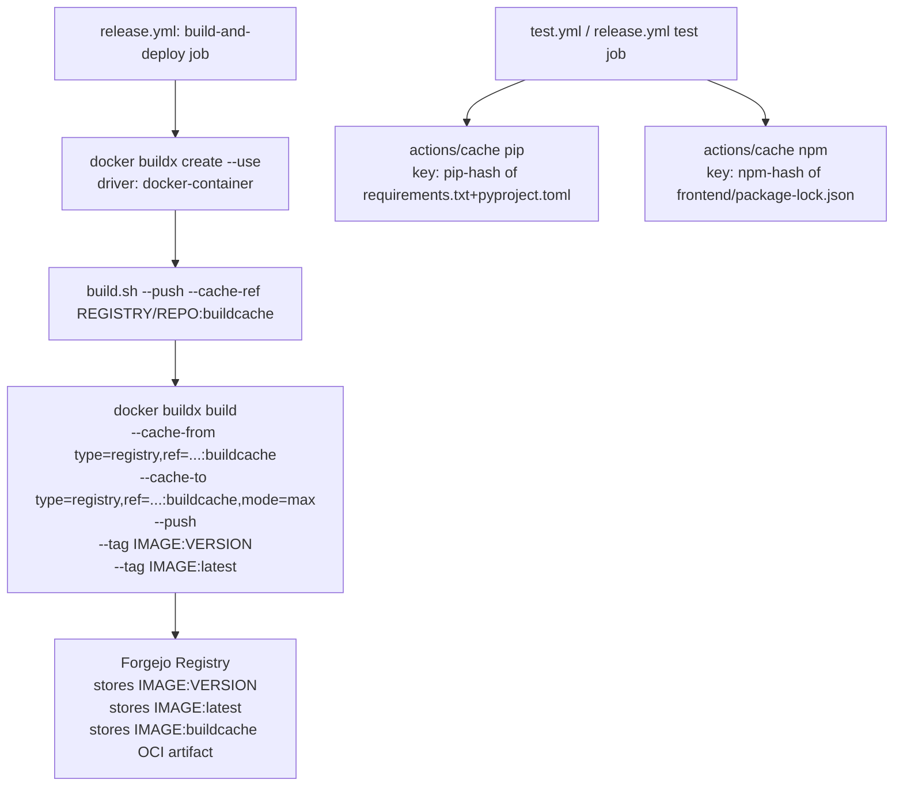

# BuildKit Registry Cache + Dependency Caching Plan

## Goal

1. Cache Python (`pip`) and Node.js (`npm`) dependencies in CI using `actions/cache`
2. Persist Docker image layers across builds using BuildKit registry cache (`--cache-to type=registry`)
3. Replace `skopeo` push with `docker buildx --push` (cleaner, fewer tools)

---

## Context

- [`Dockerfile`](../Dockerfile) already has `# syntax=docker/dockerfile:1.7` — BuildKit is ready
- [`deploy/scripts/build.sh`](../deploy/scripts/build.sh) currently uses `docker build` (line 368) with a separate `docker push` block (lines 380–387)
- [`.forgejo/workflows/release.yml`](../.forgejo/workflows/release.yml) builds via `build.sh --no-git-tag`, then pushes via `docker save | skopeo copy`
- Both [`test.yml`](../.forgejo/workflows/test.yml) and [`release.yml`](../.forgejo/workflows/release.yml) do cold pip/npm installs every run

---

## Architecture



---

## File Changes

### 1. `deploy/scripts/build.sh`

**Add `--cache-ref <tag>` CLI option** (e.g. `REGISTRY/REPO:buildcache`):

```bash
CACHE_REF=""

# In the argument parser:
--cache-ref)
  [[ $# -ge 2 ]] || die "Missing value for --cache-ref"
  CACHE_REF="$2"
  shift 2
  ;;
```

**Add buildx builder setup** (required — the default `docker` driver does NOT support `--cache-to type=registry`):

```bash
setup_buildx() {
  if ! docker buildx version >/dev/null 2>&1; then
    log "WARNING: docker buildx not available; falling back to docker build (no registry cache)"
    return 1
  fi
  docker buildx create --name tessiture-builder --driver docker-container --use 2>/dev/null \
    || docker buildx use tessiture-builder 2>/dev/null \
    || true
  docker buildx inspect --bootstrap >/dev/null 2>&1 || true
  return 0
}
```

**Replace `BUILD_CMD=(docker build ...)` with `docker buildx build`**:

```bash
# Before (lines 368–378):
BUILD_CMD=(docker build -t "${IMAGE}")
...
"${BUILD_CMD[@]}"

# After:
USE_BUILDX=0
if setup_buildx; then
  USE_BUILDX=1
fi

if [[ "${USE_BUILDX}" -eq 1 ]]; then
  BUILD_CMD=(docker buildx build --provenance=false -t "${IMAGE}")
  if [[ -n "${LATEST_IMAGE}" && "${LATEST_IMAGE}" != "${IMAGE}" ]]; then
    BUILD_CMD+=(-t "${LATEST_IMAGE}")
  fi
  if [[ -n "${CACHE_REF}" ]]; then
    BUILD_CMD+=(--cache-from "type=registry,ref=${CACHE_REF}")
    BUILD_CMD+=(--cache-to   "type=registry,ref=${CACHE_REF},mode=max")
    log "BuildKit registry cache: ${CACHE_REF}"
  fi
  if [[ "${PUSH}" -eq 1 ]]; then
    BUILD_CMD+=(--push)
  fi
  if [[ -n "${RELEASE_VERSION}" ]]; then
    BUILD_CMD+=(--build-arg "VITE_APP_VERSION=${RELEASE_VERSION}")
  fi
  BUILD_CMD+=("${REPO_ROOT}")
  "${BUILD_CMD[@]}"
else
  # Fallback: plain docker build
  BUILD_CMD=(docker build -t "${IMAGE}")
  if [[ -n "${RELEASE_VERSION}" ]]; then
    BUILD_CMD+=(--build-arg "VITE_APP_VERSION=${RELEASE_VERSION}")
  fi
  if [[ -n "${LATEST_IMAGE}" && "${LATEST_IMAGE}" != "${IMAGE}" ]]; then
    BUILD_CMD+=(-t "${LATEST_IMAGE}")
  fi
  BUILD_CMD+=("${REPO_ROOT}")
  "${BUILD_CMD[@]}"
fi
```

**Remove the separate `docker push` block** (lines 380–387) — buildx `--push` handles it. Keep the block only for the fallback (non-buildx) path.

**Update `usage()`** to document `--cache-ref`.

---

### 2. `.forgejo/workflows/release.yml` — `build-and-deploy` job

**Remove:**
- `Install skopeo` step
- `Log in to Forgejo container registry` step (skopeo login)
- The `docker save | skopeo copy` push in `Build and push Docker image`
- `Log out of container registry` step (skopeo logout)

**Add** a `docker login` step (buildx `--push` uses the Docker credential store):

```yaml
- name: Log in to Forgejo container registry
  env:
    GIT_TOKEN: ${{ github.token }}
  shell: bash
  run: |
    echo "${GIT_TOKEN}" | docker login "${REGISTRY}" \
      --username "${{ github.repository_owner }}" \
      --password-stdin
```

**Update** `Build and push Docker image` step — pass `--push` and `--cache-ref` to `build.sh`:

```yaml
- name: Build and push Docker image
  timeout-minutes: 30
  env:
    GIT_TOKEN: ${{ github.token }}
  shell: bash
  run: |
    mkdir -p examples/tracks
    CACHE_REF="${REGISTRY}/${{ github.repository }}:buildcache"
    deploy/scripts/build.sh \
      --version-bump "${{ inputs.version_bump || 'auto' }}" \
      --env-file deploy/.env \
      --no-git-tag \
      --push \
      --cache-ref "${CACHE_REF}"
```

**Replace** `Log out of container registry` with `docker logout`:

```yaml
- name: Log out of container registry
  if: always()
  shell: bash
  run: docker logout "${REGISTRY}" 2>/dev/null || true
```

**Add pip/npm cache steps** to the `test` job (before the install steps):

```yaml
- name: Cache pip packages
  uses: actions/cache@v3
  with:
    path: ~/.cache/pip
    key: pip-${{ hashFiles('requirements.txt', 'pyproject.toml') }}
    restore-keys: pip-

- name: Cache npm packages
  uses: actions/cache@v3
  with:
    path: ~/.npm
    key: npm-${{ hashFiles('frontend/package-lock.json') }}
    restore-keys: npm-
```

---

### 3. `.forgejo/workflows/test.yml`

Add the same pip/npm cache steps before the install steps:

```yaml
- name: Cache pip packages
  uses: actions/cache@v3
  with:
    path: ~/.cache/pip
    key: pip-${{ hashFiles('requirements.txt', 'pyproject.toml') }}
    restore-keys: pip-

- name: Cache npm packages
  uses: actions/cache@v3
  with:
    path: ~/.npm
    key: npm-${{ hashFiles('frontend/package-lock.json') }}
    restore-keys: npm-
```

---

## Important Notes

### `--provenance=false`
BuildKit ≥ 0.11 adds provenance attestations by default. This can cause issues with some registries (including older Forgejo versions). Adding `--provenance=false` avoids unexpected manifest list behavior.

### `PIP_NO_CACHE_DIR=1` in Dockerfile
The [`Dockerfile`](../Dockerfile:17) sets `PIP_NO_CACHE_DIR=1` — this is correct for the **image build** (avoids bloating image layers). The `actions/cache` caching is for the **CI runner** pip installs, which is a separate context. No conflict.

### `actions/cache` graceful degradation
If forgejo-runner does not support the cache API (requires runner ≥ 3.0 with `CACHE_ENDPOINT` configured), the `actions/cache` steps will gracefully no-op (cache miss = normal install). Safe to add regardless.

### buildx `docker-container` driver requirement
The default `docker` buildx driver does **not** support `--cache-to type=registry`. The `docker-container` driver runs a BuildKit daemon in a separate container and does support it. The `setup_buildx()` function in `build.sh` handles creating/reusing this builder.

### First run
On the first run, `--cache-from` will find nothing (the `:buildcache` tag doesn't exist yet) and the build proceeds normally. On subsequent runs, BuildKit pulls the cache layers and reuses them.

---

## Summary of File Changes

| File | Change |
|---|---|
| `deploy/scripts/build.sh` | Add `--cache-ref` option; add `setup_buildx()`; switch `docker build` → `docker buildx build`; integrate `--push` into buildx; remove separate push block |
| `.forgejo/workflows/release.yml` | Remove skopeo steps; add `docker login`; pass `--push --cache-ref` to `build.sh`; add pip/npm cache to test job; replace skopeo logout with docker logout |
| `.forgejo/workflows/test.yml` | Add pip cache and npm cache steps before install steps |
