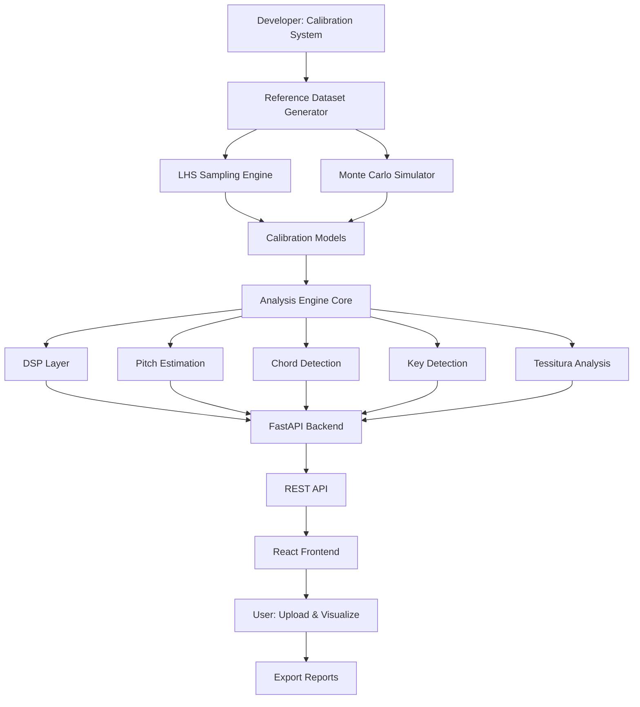
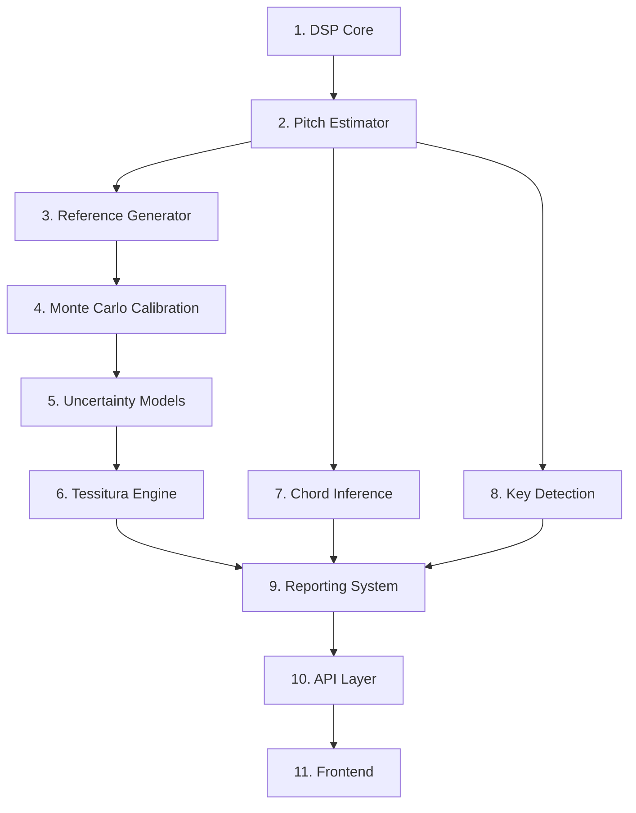

# Tessiture - Master Implementation Plan

## Executive Summary

Tessiture is a browser-based vocal analysis toolkit that provides laboratory-grade precision for analyzing acoustic and acapella audio tracks. The system computes comprehensive musical features including pitch trajectories, chord detection, key detection, tessitura analysis, and vocal range with statistically quantified uncertainties.

## System Architecture Overview



## Core Principles

### Scientific Foundation
- **Equal temperament** = logarithmic frequency lattice
- **Harmonic tones** = sparse structured spectra
- **Uncertainty quantification** via Monte Carlo propagation
- **Calibration** establishes empirical transfer functions

### Key Mathematical Mappings

**Frequency to MIDI:**
```
m = 69 + 12 * log₂(f / 440 Hz)
```

**Harmonic Salience:**
```
S(f₀, t) = w_H * H_norm + w_C * C + w_V * V + w_S * S_p
```

**Tessitura:**
```
μ_tess = Σ(w_i * m_i) / Σ(w_i)
σ²_tess = Σ(w_i² * σ_i²) / (Σ(w_i))²
```

## Repository Structure

```
tessiture/
├── calibration/
│   ├── reference_generation/
│   │   ├── lhs_sampler.py
│   │   ├── signal_generator.py
│   │   └── parameter_ranges.py
│   ├── monte_carlo/
│   │   ├── perturbation_engine.py
│   │   └── uncertainty_analyzer.py
│   └── models/
│       ├── pitch_calibration.py
│       └── confidence_models.py
├── analysis/
│   ├── dsp/
│   │   ├── preprocessing.py
│   │   ├── stft.py
│   │   └── peak_detection.py
│   ├── pitch/
│   │   ├── estimator.py
│   │   ├── path_optimizer.py
│   │   └── midi_converter.py
│   ├── chords/
│   │   ├── detector.py
│   │   ├── templates.py
│   │   └── temporal_smoother.py
│   ├── key_detection/
│   │   ├── pitch_class_histogram.py
│   │   ├── tonal_profiles.py
│   │   └── key_smoother.py
│   ├── tessitura/
│   │   ├── analyzer.py
│   │   └── vocal_range.py
│   ├── uncertainty/
│   │   ├── propagation.py
│   │   └── confidence.py
│   └── advanced/
│       ├── vibrato.py
│       ├── formants.py
│       └── phrase_segmentation.py
├── reporting/
│   ├── csv_generator.py
│   ├── json_generator.py
│   ├── visualization.py
│   └── pdf_composer.py
├── api/
│   ├── server.py
│   ├── routes.py
│   └── job_manager.py
├── frontend/
│   ├── src/
│   │   ├── components/
│   │   │   ├── AudioUploader.jsx
│   │   │   ├── AnalysisStatus.jsx
│   │   │   ├── AnalysisResults.jsx
│   │   │   ├── PitchCurve.jsx
│   │   │   ├── PianoRoll.jsx
│   │   │   ├── TessituraHeatmap.jsx
│   │   │   └── ReportExporter.jsx
│   │   ├── App.jsx
│   │   └── api.js
│   └── package.json
├── notebooks/
│   └── calibration_builder.ipynb
├── tests/
│   ├── test_calibration/
│   ├── test_analysis/
│   └── test_api/
├── docs/
│   ├── mathematical_specification.md
│   ├── api_documentation.md
│   └── user_guide.md
├── requirements.txt
├── package.json
└── README.md
```

## Implementation Phases

### Phase 1: Calibration System (Developer-Only)

#### 1.1 Reference Dataset Generation
**Purpose:** Create synthetic audio signals with known ground truth for calibration

**Components:**
- Latin Hypercube Sampling (LHS) across parameter space
- Synthetic signal generation (1-4 note combinations)
- Parameter ranges:
  - Fundamental frequency: 82 Hz → 2093 Hz (E2 → C7)
  - Detuning: ±50 cents
  - Amplitude: -20 → 0 dBFS
  - Harmonic ratios: 0.1 → 1.0
  - Note count: 1 → 4
  - Duration: 0.05 → 3 s
  - SNR: 20 → 60 dB
  - Vibrato depth: ±20 cents
  - Vibrato rate: 3-8 Hz

**Libraries:**
- `numpy`, `scipy`, `pyDOE2`, `librosa`

#### 1.2 Monte Carlo Calibration
**Purpose:** Quantify uncertainties through systematic perturbations

**Perturbations per sample (N=100-500 realizations):**
- Gaussian noise at varying SNR
- Window misalignment
- Phase jitter
- Amplitude drift
- Resampling error

**Outputs:**
- `pitch_bias(f)` - frequency-dependent correction
- `pitch_variance(f)` - uncertainty bounds
- `confidence_surface` - detection probability maps
- `detection_probability` - note/chord detection rates

#### 1.3 Calibration Model Fitting
**Purpose:** Create correction functions for runtime analysis

**Models:**
- Pitch bias correction: `f_corrected = f_raw - b(f)`
- Uncertainty lookup tables
- Confidence interpolants
- Detection threshold optimization

### Phase 2: Analysis Engine Core

#### 2.1 DSP Layer
**Components:**
- Audio preprocessing (resampling, normalization)
- STFT with Hann window
- Harmonic peak detection
- Spectral reassignment

**Key Functions:**
```python
def compute_stft(audio, n_fft=4096, hop_length=512):
    # Returns X(f,t) with frequency uncertainty σ_f
    
def detect_harmonics(X, n_harmonics=4):
    # Returns candidate f0s and amplitudes A_n
```

#### 2.2 Pitch Estimation
**Hybrid approach:**
- Harmonic Product Spectrum (HPS)
- Autocorrelation
- Spectral reassignment

**Salience function:**
```python
S(f₀, t) = w_H * H_norm + w_C * C + w_V * V + w_S * S_p
```

Where:
- `H_norm` = harmonic alignment score
- `C` = temporal continuity
- `V` = vibrato score
- `S_p` = spectral prominence

#### 2.3 Lead Voice Path Optimization
**Viterbi dynamic programming:**
```python
E_path = Σ_t S(f₀, t) - λ * Σ_t |m_t - m_{t-1}|
```

Finds optimal pitch trajectory maximizing salience while penalizing discontinuities.

#### 2.4 MIDI Conversion with Uncertainty
```python
m = 69 + 12 * log₂(f₀ / 440)
σ_m = (12 / ln(2)) * (σ_f / f₀)
```

Includes calibration correction and uncertainty propagation.

### Phase 3: Musical Feature Extraction

#### 3.1 Chord Detection (≤4 notes)
**Algorithm:**
1. Build interval graph from candidate notes
2. Match to chord templates (dyads, triads, tetrads)
3. Compute softmax probabilities:
   ```python
   P(C_i) = exp(β * score_i) / Σ_j exp(β * score_j)
   ```
4. Optional HMM temporal smoothing

**Supported chords:**
- Major/minor triads
- Diminished/augmented triads
- Dominant 7th, major 7th, minor 7th

#### 3.2 Key Detection
**Krumhansl-Schmuckler algorithm:**
1. Compute pitch class histogram `h_k(t)`
2. Match to tonal profiles (major/minor)
3. Calculate correlation scores:
   ```python
   L_r = (h · roll(PROFILE, r)) / (||h|| * ||roll(PROFILE, r)||)
   ```
4. Convert to probabilities via softmax
5. Optional Viterbi smoothing for temporal consistency

#### 3.3 Tessitura Analysis
**Rigorous statistical approach:**
- Weighted pitch PDF
- Comfort band (70% occupancy percentiles)
- Strain zones (high variance regions)

**Metrics:**
- Range: min/max notes
- Tessitura band: 15th-85th percentiles
- Comfort center: weighted mean
- Uncertainty: propagated variance

### Phase 4: Uncertainty Quantification

#### 4.1 Pitch Uncertainty
```python
σ²_m = σ²_analytic + σ²_calibration
```

#### 4.2 Chord & Key Confidence
```python
P(C_i) = Σ_j P(C_i | N_j) * P(N_j)
H(P(K)) = -Σ_i P(K_i) * log(P(K_i))
confidence = 1 - H(P(K)) / log(24)
```

#### 4.3 Extremum Notes
Monte Carlo sampling for min/max note confidence intervals:
```python
m_i ~ N(μ_i, σ²_i)
CI_95% = [percentile(2.5), percentile(97.5)]
```

### Phase 5: Advanced Features (Optional)

#### 5.1 Vibrato Detection
- FFT of f₀ deviation
- Extract rate (Hz) and depth (cents)

#### 5.2 Formant Estimation
- F1, F2, F3 trajectory computation
- Voice classification hints

#### 5.3 Phrase Segmentation
- Energy-based boundary detection
- Continuity analysis

### Phase 6: Reporting System

#### 6.1 CSV Export
```csv
time, f0, note, cents, confidence, chord, key
```

#### 6.2 JSON Export
Structured data with full metadata:
- Frame-level pitch data
- Note events
- Chord timeline
- Key trajectory
- Tessitura metrics
- Uncertainty bounds

#### 6.3 Visualization
**Plots:**
- Scrolling pitch curve with confidence shading
- Piano roll overlay
- Tessitura heatmap
- Chord timeline
- Key stability graph

**Libraries:** `matplotlib`, `plotly`

#### 6.4 PDF Report
**Sections:**
- Executive summary
- Vocal range & tessitura
- Key analysis
- Chord progression
- Technical appendix with uncertainties

**Library:** `reportlab`

### Phase 7: FastAPI Backend

#### 7.1 API Endpoints
```python
POST /analyze          # Upload audio, start job
GET  /status/{job_id}  # Check progress
GET  /results/{job_id} # Download JSON/CSV/PDF
```

#### 7.2 Job Management
- Async processing with job queue
- Progress tracking
- Result caching
- Error handling

#### 7.3 CORS & Security
- CORS configuration for frontend
- File upload validation
- Rate limiting

### Phase 8: React Frontend

#### 8.1 Components
- **AudioUploader**: File selection and upload
- **AnalysisStatus**: Progress bar and status updates
- **AnalysisResults**: Main results dashboard
- **PitchCurve**: Interactive pitch trajectory plot
- **PianoRoll**: Note visualization with confidence
- **TessituraHeatmap**: Vocal range density map
- **ReportExporter**: Download buttons for CSV/JSON/PDF

#### 8.2 Visualization Libraries
- **Plotly.js**: Interactive plots
- **WebAudio API**: Audio playback with sync
- **React**: Component framework

#### 8.3 State Management
- Job ID tracking
- Results caching
- UI state management

### Phase 9: Testing & Validation

#### 9.1 Calibration Validation
- Verify synthetic signal ground truth
- Check Monte Carlo convergence
- Validate calibration model accuracy

#### 9.2 Analysis Engine Tests
- Unit tests for each DSP function
- Integration tests for full pipeline
- Regression tests against reference dataset

#### 9.3 API Tests
- Endpoint functionality
- Error handling
- Performance benchmarks

#### 9.4 Frontend Tests
- Component rendering
- User interaction flows
- Cross-browser compatibility

### Phase 10: Documentation

#### 10.1 Mathematical Specification
Complete formulas and derivations (already exists in [`tessiture_kilo_reference.md`](tessiture_kilo_reference.md))

#### 10.2 API Documentation
- OpenAPI/Swagger specification
- Request/response examples
- Error codes

#### 10.3 User Guide
- Upload instructions
- Interpretation of results
- Best practices for audio preparation

#### 10.4 Developer Guide
- Setup instructions
- Calibration workflow
- Extension points

## Performance Targets

| Metric | Target |
|--------|--------|
| 3-min song analysis | < 10 seconds |
| Memory usage | < 1 GB |
| Pitch accuracy | ± 3 cents |
| Key accuracy | > 95% (clean vocal) |
| Chord detection | > 90% (1-4 notes) |

## Technology Stack

### Backend
- **Python 3.9+**
- **Core Libraries:**
  - `numpy` - numerical computation
  - `scipy` - signal processing
  - `librosa` - audio analysis
  - `pyDOE2` - Latin Hypercube Sampling
  - `numba` - JIT compilation for performance
- **API Framework:**
  - `fastapi` - REST API
  - `uvicorn` - ASGI server
  - `pydantic` - data validation
- **Reporting:**
  - `matplotlib` - plotting
  - `plotly` - interactive plots
  - `reportlab` - PDF generation

### Frontend
- **React 18+**
- **Plotly.js** - interactive visualizations
- **WebAudio API** - audio playback
- **Axios** - HTTP client

### Development Tools
- **Jupyter Notebook** - calibration development
- **pytest** - testing
- **black** - code formatting
- **mypy** - type checking

## Versioning Strategy

| Version | Codename | Description |
|---------|----------|-------------|
| v0.x | **Synth** | Experimental development. Synthetic reference datasets for calibration. |
| v1.x | **Tessa** | First official release. Real-world evaluation with Tessa test dataset. |

## Dataset Conventions

- `REFERENCE_DATASET` - Calibration data with known ground truth (synthetic)
- `TESSA_DATASET` - Real-world evaluation data (future)

## Critical Implementation Notes

### 1. Monte Carlo Belongs in Calibration
Monte Carlo simulations are **developer-side only** for calibration. Runtime analysis uses **only** the pre-computed calibration models.

### 2. Calibration is One-Time
Calibration is performed once during development. It only needs to be repeated if:
- Analysis algorithms change
- New features are added
- Accuracy improvements are needed

### 3. Uncertainty Propagation
Every output carries uncertainty:
- Pitch: `σ_m` from frequency uncertainty
- Chords: probability distribution
- Key: confidence score
- Tessitura: variance bounds

### 4. Lead Voice Selection
For polyphonic audio, the system identifies the **lead vocal line** using:
- Harmonic salience
- Temporal continuity
- Spectral prominence
- Vibrato characteristics

### 5. Closed-Form Mappings
For 1-4 note combinations, all mappings are **analytically deterministic**:
- Frequency → MIDI
- MIDI → pitch class
- Pitch classes → chord intervals
- Intervals → chord type

## Execution Order (Critical Path)



## Future Extensions

- Real-time analysis
- Singer comparison metrics
- Vocal health indicators
- Automatic backing key suggestion
- DAW plugin (VST3)
- Multi-track analysis
- Harmony detection

## Success Criteria

### Calibration Phase
- [ ] Reference dataset covers full vocal range (E2-C7)
- [ ] Monte Carlo convergence achieved (< 1% variance)
- [ ] Calibration models reduce pitch bias to < 3 cents
- [ ] Detection probabilities validated against ground truth

### Analysis Engine
- [ ] Pitch tracking accuracy ± 3 cents on synthetic data
- [ ] Chord detection > 90% accuracy (1-4 notes)
- [ ] Key detection > 95% accuracy (clean vocals)
- [ ] Tessitura metrics match ground truth within 1 semitone

### System Integration
- [ ] API response time < 10s for 3-min audio
- [ ] Memory usage < 1 GB
- [ ] All outputs include uncertainty quantification
- [ ] Reports are publication-ready

### User Experience
- [ ] Upload and analysis workflow < 5 clicks
- [ ] Interactive visualizations render smoothly
- [ ] Reports download in all formats (CSV/JSON/PDF)
- [ ] Error messages are clear and actionable

## Risk Mitigation

### Technical Risks
1. **Polyphonic complexity** - Mitigated by lead voice selection algorithm
2. **Computational performance** - Mitigated by numba JIT compilation
3. **Calibration accuracy** - Mitigated by extensive Monte Carlo validation
4. **Browser compatibility** - Mitigated by standard WebAudio API usage

### Project Risks
1. **Scope creep** - Mitigated by phased implementation
2. **Algorithm complexity** - Mitigated by pseudocode specifications
3. **Integration challenges** - Mitigated by clear API contracts

## References

### Scientific Literature
- Krumhansl & Kessler, *Cognitive Foundations of Musical Pitch*, 1982
- Boersma, *Accurate short-term analysis of the fundamental frequency*, 1993
- Tzanetakis & Cook, *Musical genre classification of audio signals*, 2002

### Technical References
- *Numerical Recipes*, 2007 (Monte Carlo methods)
- Librosa documentation
- FastAPI documentation
- React documentation

## Appendix: Key Formulas Reference

### Frequency to MIDI
```
m = 69 + 12 * log₂(f / 440)
```

### Harmonic Salience
```
S = w_H * H + w_C * C + w_V * V + w_S * S_p
```

### Chord Probability
```
P(C_i) = Σ_j P(C_i | N_j) * P(N_j)
```

### Key Softmax
```
P(K_i) = exp(β * L_i) / Σ_j exp(β * L_j)
```

### Tessitura
```
μ_tess = Σ(w_i * m_i) / Σ(w_i)
σ²_tess = Σ(w_i² * σ_i²) / (Σ(w_i))²
```

### Tonal Stability
```
S = 1 - H(P(K)) / log(24)
```

### Extremum Confidence Interval
```
CI_95% = percentiles of N(μ_i, σ²_i)
```

---

**Document Status:** Master Implementation Plan v1.0  
**Last Updated:** 2026-02-26  
**Maintained By:** Tessiture Development Team
