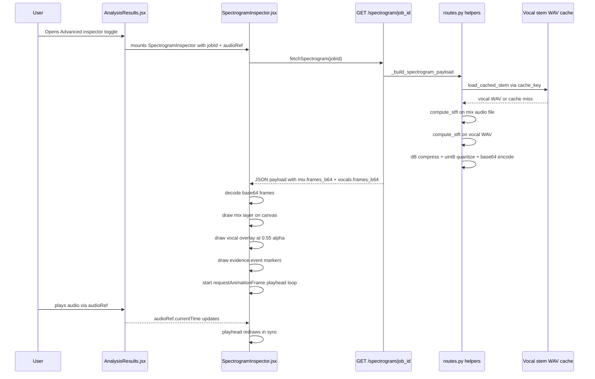

# Phase 2 — Interactive Audio Spectrogram Inspector: Architecture Spec

> Status: Spec — not yet implemented.
> Related: Phase 1 evidence-linked diagnostics (completed).

---

## 1. Existing DSP / Separation Capability Inventory

### 1.1 `analysis/dsp/stft.py` — [`compute_stft()`](analysis/dsp/stft.py:39)

- Input: mono float32 array, `sample_rate`, `n_fft=4096`, `hop_length=512`.
- Returns [`StftResult`](analysis/dsp/stft.py:16): `spectrum` (freq × time, float32), `frequencies` array, `times` array, `sigma_f`, `window_norm`.
- Already called in [`api/routes.py`](api/routes.py:26) and used as the backbone of the pitch pipeline.
- **Directly reusable** for spectrogram generation — no new DSP code required.

### 1.2 `analysis/dsp/vocal_separation.py` — [`separate_vocals()`](analysis/dsp/vocal_separation.py:114)

- Uses Demucs `htdemucs` model; returns [`SeparationResult`](analysis/dsp/vocal_separation.py:23) with `vocals` (float32 mono numpy array) and `sample_rate`.
- Already disk-caches separated stems as WAV at a per-file SHA-256 key under a configurable `cache_dir`.
- Cached WAV path is deterministically derivable from `cache_key(file_path)` + cache dir → `{key}.wav`.
- `is_available()` guard exists; separation is already conditional in the main analysis pipeline.
- **Vocal audio is already on disk post-separation** — the cache WAV is the backing source for the vocal spectrogram computation.

### 1.3 `analysis/dsp/preprocessing.py` — [`preprocess_audio()`](analysis/dsp/preprocessing.py:97)

- Handles mono/stereo conversion, resampling, normalization.
- Mix audio is already preprocessed to `TARGET_SAMPLE_RATE = 44100` before the main STFT call.
- No changes needed in preprocessing for the spectrogram inspector.

### 1.4 `api/routes.py` — Payload builder patterns

- Main analysis job runs in [`_run_analysis()`](api/routes.py:73) via `job_manager.create_job`.
- Results are stored in job memory and served by [`GET /results/{job_id}`](api/routes.py:2000).
- Evidence payload is built by [`_build_evidence_payload()`](api/routes.py:1046), producing `evidence.events[]` with `id`, `label`, `timestamp_s`, `timestamp_label` per event.
- The existing `"evidence"` key is part of `analysis_payload` at line 1747 — the spectrogram data must **not** be injected here; it belongs in a separate lazy endpoint.

---

## 2. Dual-Layer Spectrogram Inspector — Component Design

### 2.1 Visual Layer Stack

```
Canvas (single <canvas> element, absolute-positioned layers via compositing)
├── Layer 0 — Full-mix spectrogram  (base, drawn first)
│     Color palette: dark background, blue-to-yellow heat map (e.g. viridis/turbo)
│     Opacity: 1.0
│
├── Layer 1 — Vocal overlay spectrogram  (drawn on top with globalAlpha)
│     Color palette: distinct warm hue (e.g. red-orange gradient)
│     Opacity: 0.55 (configurable)
│
├── Layer 2 — Evidence event markers  (thin vertical lines)
│     Color: white or accent, per-event label tooltip on hover
│
├── Layer 3 — Playhead  (animated vertical line)
│     Synchronized to audioRef.currentTime via requestAnimationFrame
│
└── Layer 4 — Optional overlays  (P2-D only)
      Pitch line: derived from pitch_frames[].{time, f0_hz}, mapped to freq axis
      Energy bar: thin horizontal strip below canvas showing RMS per frame
```

### 2.2 Frequency Axis

- Display range: **80 Hz – 8000 Hz** (vocal-relevant band) with mel-scale Y axis for perceptual uniformity.
- Frequency bins from `StftResult.frequencies` are pre-filtered to this range server-side before transmission.
- Display is **log-scale** (mel-approximated) on canvas: `y = canvasH * (1 - log(f/80) / log(8000/80))`.

### 2.3 UX Toggle

- Hidden by default behind an **"Advanced inspector"** `<details>` or button-toggled `<section>` at the bottom of the Evidence references section in [`AnalysisResults.jsx`](frontend/src/components/AnalysisResults.jsx:712).
- Opening the toggle initiates the lazy fetch; canvas renders once data arrives.
- No change to existing text-first guidance cards or evidence rows above.

---

## 3. Backend Data Contract

### 3.1 New Endpoints

```
GET /spectrogram/{job_id}
```

- **Lazy** — not called by the main `/results/{job_id}` flow; only triggered by frontend toggle open.
- Returns JSON payload (see §3.2).
- Returns `404` if `job_id` not found; `409` if job not completed; `503` if spectrogram unavailable (e.g. Demucs not installed).

### 3.2 Response Payload Shape

```json
{
  "mix": {
    "frames": [ [f32, f32, ...], ... ],
    "frequencies_hz": [80.2, 82.1, ...],
    "times_s": [0.0, 0.0116, ...],
    "n_fft": 4096,
    "hop_length": 512,
    "sample_rate": 44100
  },
  "vocals": {
    "frames": [ [f32, f32, ...], ... ],
    "frequencies_hz": [80.2, 82.1, ...],
    "times_s": [0.0, 0.0116, ...],
    "available": true
  }
}
```

- **`frames`**: 2-D float32 array, shape `(n_time_frames, n_freq_bins)` — **transposed** from `StftResult.spectrum` (freq × time) for row-major JSON serialization efficiency.
- **`frequencies_hz`**: 1-D array of frequency bin centers, pre-filtered to 80–8000 Hz range (approx. 300–400 bins out of 2049 for n_fft=4096).
- **`times_s`**: 1-D array of frame times in seconds.
- `vocals.available = false` when Demucs is not installed or separation failed; frontend renders mix-only in that case.

### 3.3 Payload Size Estimate

For a 3-minute recording at 44100 Hz, hop=512:
- Total time frames ≈ `180 * 44100 / 512 ≈ 15,503`
- Frequency bins (80–8000 Hz filtered) ≈ `350`
- Mix matrix size: `15503 × 350 × 4 bytes ≈ 21.7 MB raw`

**Recommendation: apply dB/log compression and quantize to uint8 (0–255) before JSON serialization.**  
- Convert `spectrum` → `20 * log10(spectrum + 1e-9)`, normalize to [0, 255], store as uint8.
- After compression: `15503 × 350 × 1 byte ≈ 5.4 MB` — acceptable for a lazy-loaded supplemental endpoint.
- Alternatively, transmit as base64-encoded uint8 flat array and reconstruct dimensions using `n_time_frames` + `n_freq_bins` metadata fields.

Preferred encoding: **`"frames_b64": "<base64 string>"` with `n_time` and `n_freq` ints** — avoids nested JSON array overhead and halves browser parse time.

### 3.4 Vocal Audio Source

The existing [`save_stem_to_cache()`](analysis/dsp/vocal_separation.py:96) writes `{sha256_key}.wav` to the cache dir.  
The spectrogram endpoint will:
1. Compute `cache_key(original_file_path)` — already stored in `job_manager` result metadata via the existing `separation_info` dict in `metadata_payload`.
2. Load the cached WAV using `soundfile.read()`.
3. Run `compute_stft()` on the vocal audio (same `n_fft`, same `hop_length` as the mix).
4. Apply the same dB-log-compression + uint8 quantization.

No re-separation is required if the stem is already cached. If the cache miss occurs (e.g., cache was cleared), the endpoint falls back to `available: false`.

### 3.5 Backward Compatibility

- The `GET /results/{job_id}` payload is **not modified**. Existing consumers see no change.
- Old job results without a cached vocal stem return `vocals.available = false` gracefully.
- `GET /spectrogram/{job_id}` returns `404` for any `job_id` not in memory — clients must handle this.

---

## 4. Frontend Component Architecture

### 4.1 New Component: `SpectrogramInspector`

**File**: [`frontend/src/components/SpectrogramInspector.jsx`](frontend/src/components/SpectrogramInspector.jsx)

**Props**:
```js
{
  jobId: string,            // used to fetch /spectrogram/{jobId}
  audioRef: React.Ref,      // shared with AnalysisResults — points to <audio> element
  evidenceEvents: Array,    // evidence.events[] from Phase 1
  durationSeconds: number,  // from results.metadata.duration_seconds
}
```

**Internal state**:
- `spectrogramData` — fetched payload or null
- `loading` / `error` — fetch lifecycle
- `isOpen` — controls visibility via toggle (lazy fetch fires on first open)

### 4.2 Canvas Rendering Strategy

- Single `<canvas>` element with `useRef`.
- On `spectrogramData` change: decode base64 uint8 frames, draw mix layer (blue-yellow palette), draw vocals overlay layer (red-orange palette at alpha 0.55) using `ctx.globalAlpha`.
- Playhead: `requestAnimationFrame` loop reads `audioRef.current.currentTime`, maps to canvas X coordinate `x = (t / durationSeconds) * canvasW`, draws a 1px white vertical line. Tears down on unmount via returned cleanup.
- Evidence markers: drawn once during spectrogram paint phase — one colored vertical stripe per `event.timestamp_s` with a small label at top.
- Spectrogram data is rendered off-screen first via `OffscreenCanvas` (or ImageData) then `drawImage`'d onto the visible canvas for smooth repaints.

### 4.3 Integration into `AnalysisResults.jsx`

- Import `SpectrogramInspector` into [`AnalysisResults.jsx`](frontend/src/components/AnalysisResults.jsx).
- Pass `audioRef` (already declared at line 416), `results?.evidence?.events`, `jobId` (new prop threaded from parent), and `duration`.
- Place `<SpectrogramInspector>` inside an `<details>` element below the existing Evidence references section (line ~783), with summary label "Advanced audio inspector".
- `jobId` must be threaded from [`App.jsx`](frontend/src/App.jsx) or wherever `results` originates — same pattern as `audioSourceUrl`.

### 4.4 Evidence Event Marker Plotting

Each event in `evidence.events[]` has `timestamp_s` (number). Map to canvas X:
```
x = (event.timestamp_s / durationSeconds) * canvasWidth
```
Draw a 2px translucent vertical line (e.g. rgba(255,255,100,0.7)) spanning the full canvas height. On `mousemove`, detect proximity and show a floating tooltip with `event.label`.

### 4.5 New API helper in `api.js`

Add `fetchSpectrogram(jobId)` to [`frontend/src/api.js`](frontend/src/api.js):
```js
export async function fetchSpectrogram(jobId) {
  const res = await fetch(`/spectrogram/${jobId}`);
  if (!res.ok) throw new Error(`Spectrogram unavailable (${res.status})`);
  return res.json();
}
```

---

## 5. Phased Delivery Plan — Exact File Targets

### P2-A: Backend spectrogram data endpoint

| Action | File |
|---|---|
| Add `GET /spectrogram/{job_id}` route | [`api/routes.py`](api/routes.py) |
| Add `_build_spectrogram_payload()` helper | [`api/routes.py`](api/routes.py) |
| Store `file_path` + `cache_key` in job metadata for stem lookup | [`api/routes.py`](api/routes.py) |
| Add backend test for new endpoint | [`tests/test_api/test_routes.py`](tests/test_api/test_routes.py) |

Notes:
- Helper calls `compute_stft()` on mix audio (re-runs from stored file path) and on cached vocal WAV.
- Applies dB compression + uint8 quantization + base64 encoding.
- Returns `vocals.available: false` if Demucs cache miss or not installed.

### P2-B: Frontend `SpectrogramInspector` component

| Action | File |
|---|---|
| Create component | [`frontend/src/components/SpectrogramInspector.jsx`](frontend/src/components/SpectrogramInspector.jsx) |
| Add `fetchSpectrogram()` API helper | [`frontend/src/api.js`](frontend/src/api.js) |
| Thread `jobId` prop into `AnalysisResults` | [`frontend/src/components/AnalysisResults.jsx`](frontend/src/components/AnalysisResults.jsx) |
| Add `<details>`/toggle + mount `SpectrogramInspector` | [`frontend/src/components/AnalysisResults.jsx`](frontend/src/components/AnalysisResults.jsx) |
| Add CSS for canvas container and toggle | [`frontend/src/styles.css`](frontend/src/styles.css) |
| Add component tests | [`frontend/src/components/components.test.jsx`](frontend/src/components/components.test.jsx) |

### P2-C: Evidence event marker integration

| Action | File |
|---|---|
| Plot markers from `evidenceEvents` prop on canvas | [`frontend/src/components/SpectrogramInspector.jsx`](frontend/src/components/SpectrogramInspector.jsx) |
| Hover tooltip display for event labels | [`frontend/src/components/SpectrogramInspector.jsx`](frontend/src/components/SpectrogramInspector.jsx) |
| Test: markers render at correct x offsets given known timestamps | [`frontend/src/components/components.test.jsx`](frontend/src/components/components.test.jsx) |

### P2-D: Optional overlays (pitch line + energy bar)

| Action | File |
|---|---|
| Pitch line: draw f0 curve from `pitch_frames[]` mapped to canvas freq axis | [`frontend/src/components/SpectrogramInspector.jsx`](frontend/src/components/SpectrogramInspector.jsx) |
| Energy bar: compute per-frame RMS from spectrogram data, render as thin strip | [`frontend/src/components/SpectrogramInspector.jsx`](frontend/src/components/SpectrogramInspector.jsx) |
| Pass `pitchFrames` as optional prop from `AnalysisResults` | [`frontend/src/components/AnalysisResults.jsx`](frontend/src/components/AnalysisResults.jsx) |

---

## 6. Data Flow Diagram



---

## 7. Acceptance Criteria

| # | Criterion | Verification |
|---|---|---|
| AC-1 | Full-mix spectrogram renders on canvas in correct blue-yellow heat-map palette | Visual inspection + canvas pixel sampling in test |
| AC-2 | Vocal overlay renders at distinct warm hue with ~0.55 alpha on the same canvas, visibly distinguishable | Visual inspection |
| AC-3 | Playhead vertical line moves in sync with `audioRef.current.currentTime` during playback | Manual + unit test mocking `currentTime` increments |
| AC-4 | Evidence event markers appear as vertical lines at x positions proportional to `event.timestamp_s / durationSeconds` | Unit test with known timestamps |
| AC-5 | Toggling inspector open/closed does not affect text-first guidance cards, evidence rows, or playback state | Regression: existing test suite passes unmodified |
| AC-6 | `GET /results/{job_id}` payload is identical before and after P2-A (no new keys, no regressions) | `python -m pytest tests/test_api/test_routes.py` passes |
| AC-7 | `vocals.available: false` returned gracefully when Demucs is not installed or cache miss; frontend renders mix-only | Unit test with `is_available()` returning False |
| AC-8 | Inspector hidden by default; only rendered/fetched after user opens the toggle | DOM test: `SpectrogramInspector` not mounted until toggle opened |

---

## 8. Known Constraints and Risks

| Risk | Mitigation |
|---|---|
| Payload size ~5 MB may feel slow on first open | Lazy endpoint + loading spinner; can add resolution decimation flag if needed |
| Demucs not available in all deployments | `vocals.available: false` path fully handled frontend and backend |
| `requestAnimationFrame` loop memory leak on unmount | Return cleanup from `useEffect` to cancel loop |
| `jobId` not currently threaded into `AnalysisResults` from all call sites | Thread via new prop; existing call sites without it degrade gracefully (inspector shows disabled state) |
| Re-running STFT on original file for spectrogram endpoint requires file to still be on disk | File is in `UPLOAD_DIR`; if TTL-evicted, return 503 with clear message |
