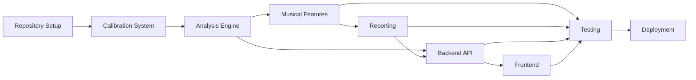

# Tessiture - Quick Start Guide

## Overview

This guide provides a quick reference for implementing the Tessiture vocal analysis toolkit. For complete details, see [`MASTER_IMPLEMENTATION_PLAN.md`](MASTER_IMPLEMENTATION_PLAN.md).

## Implementation Phases

### Phase 1: Calibration System (Items 1-19)
**Goal:** Create synthetic reference dataset and calibration models

**Key Deliverables:**
- LHS parameter sampling
- Synthetic signal generator (1-4 notes)
- Monte Carlo perturbation engine
- Calibration models with pitch bias correction

**Critical Path:**
1. Set up repository structure
2. Implement signal generation
3. Run Monte Carlo simulations
4. Fit calibration models

### Phase 2: Analysis Engine Core (Items 10-19)
**Goal:** Build DSP and pitch estimation pipeline

**Key Deliverables:**
- STFT with frequency uncertainty
- Harmonic peak detection
- Viterbi path optimization
- MIDI conversion with uncertainty

**Critical Path:**
1. DSP preprocessing
2. STFT computation
3. Harmonic salience
4. Lead pitch selection

### Phase 3: Musical Feature Extraction (Items 20-29)
**Goal:** Implement chord, key, and tessitura analysis

**Key Deliverables:**
- Chord detection (≤4 notes)
- Key detection (Krumhansl-Schmuckler)
- Tessitura with comfort bands
- Uncertainty propagation

**Critical Path:**
1. Chord template matching
2. Pitch class histogram
3. Tonal profile matching
4. Tessitura calculation

### Phase 4: Advanced Features (Items 30-33)
**Goal:** Add vibrato, formants, and phrase segmentation

**Key Deliverables:**
- Vibrato rate/depth detection
- Formant estimation (F1, F2, F3)
- Phrase boundary detection

### Phase 5: Reporting System (Items 34-38)
**Goal:** Generate exports and visualizations

**Key Deliverables:**
- CSV/JSON exports
- Interactive plots (matplotlib, plotly)
- PDF reports

### Phase 6: Backend API (Items 39-44)
**Goal:** Create FastAPI server with job management

**Key Deliverables:**
- POST /analyze endpoint
- GET /status endpoint
- GET /results endpoint
- Async job queue

### Phase 7: Frontend (Items 45-54)
**Goal:** Build React UI with visualizations

**Key Deliverables:**
- Audio uploader
- Analysis status tracker
- Interactive results dashboard
- Report exporter

### Phase 8: Testing & Documentation (Items 55-67)
**Goal:** Validate and document the system

**Key Deliverables:**
- Unit and integration tests
- API documentation
- User and developer guides

### Phase 9: Deployment (Items 68-73)
**Goal:** Optimize and release v0.1

**Key Deliverables:**
- Performance validation
- Cross-browser testing
- Deployment scripts

## Critical Dependencies



## Key Files to Reference

### Existing Documentation
- [`README.md`](../README.md) - Project overview and versioning
- [`tessiture_design_plan.md`](../tessiture_design_plan.md) - Mathematical background and calibration details
- [`tessiture_kilo_reference.md`](../tessiture_kilo_reference.md) - System architecture and pseudocode

### New Planning Documents
- [`MASTER_IMPLEMENTATION_PLAN.md`](MASTER_IMPLEMENTATION_PLAN.md) - Complete implementation specification
- This file - Quick navigation guide

## Technology Stack Summary

### Backend
- Python 3.9+
- numpy, scipy, librosa, pyDOE2
- FastAPI, uvicorn
- matplotlib, plotly, reportlab

### Frontend
- React 18+
- Plotly.js
- WebAudio API
- Axios

### Development
- Jupyter Notebook
- pytest
- black, mypy

## Performance Targets

| Metric | Target |
|--------|--------|
| Analysis time (3-min audio) | < 10 seconds |
| Memory usage | < 1 GB |
| Pitch accuracy | ± 3 cents |
| Key accuracy | > 95% |
| Chord detection | > 90% |

## Key Mathematical Formulas

### Frequency to MIDI
```
m = 69 + 12 * log₂(f / 440)
```

### Harmonic Salience
```
S = w_H * H_norm + w_C * C + w_V * V + w_S * S_p
```

### Tessitura
```
μ_tess = Σ(w_i * m_i) / Σ(w_i)
```

## Next Steps

1. **Review** the master implementation plan
2. **Set up** the repository structure
3. **Start** with Phase 1 (Calibration System)
4. **Follow** the todo list in sequential order
5. **Test** each component before moving to the next phase

## Getting Help

- Mathematical details → [`tessiture_design_plan.md`](../tessiture_design_plan.md)
- Architecture details → [`tessiture_kilo_reference.md`](../tessiture_kilo_reference.md)
- Implementation details → [`MASTER_IMPLEMENTATION_PLAN.md`](MASTER_IMPLEMENTATION_PLAN.md)

---

**Last Updated:** 2026-02-26
