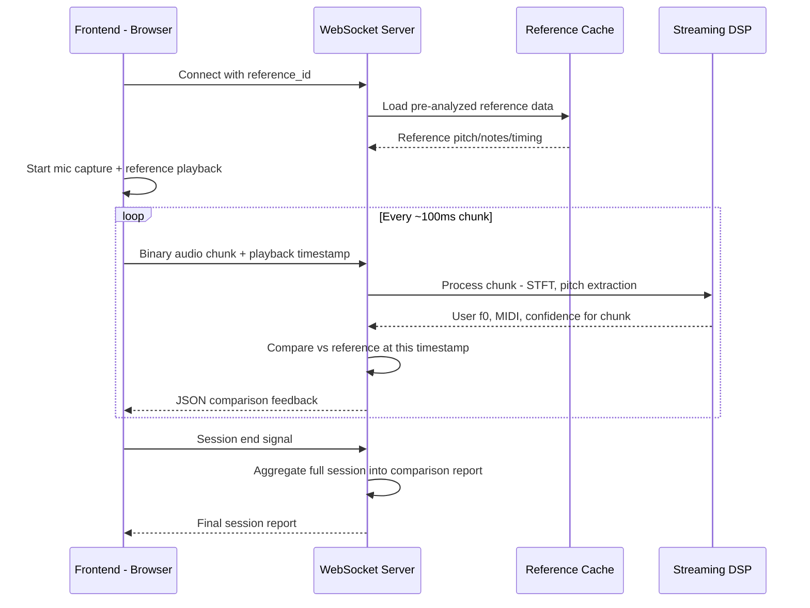
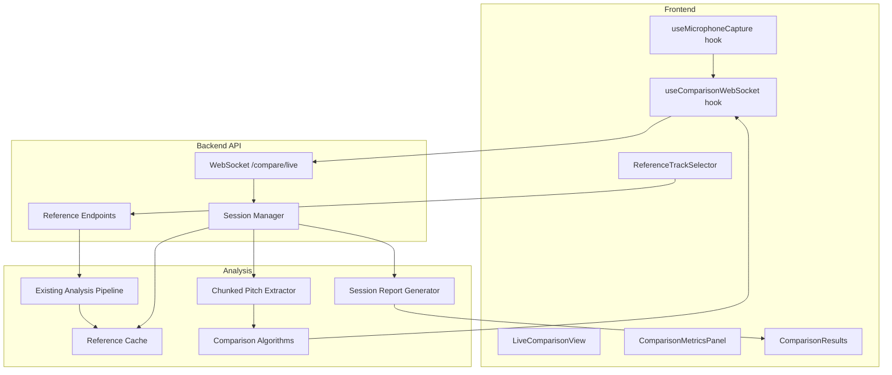

# Reference Track Comparison — Architecture Plan

## Overview

Tessiture Use Case 2: Allow a practicing vocalist to sing alongside a reference track and receive **real-time comparative vocal feedback**. The user selects a reference (from the example gallery or by uploading), plays it through headphones, sings into their microphone, and sees live analysis comparing their voice against the reference pitch, timing, range, and vocal characteristics.

After the session, a comprehensive comparison report is generated — mirroring the depth of the existing Use Case 1 analysis reports but now with head-to-head metrics.

---

## Design Principles

1. **Real-time first** — The primary workflow is live mic → stream chunks → instant feedback. Upload-based batch comparison is secondary.
2. **Reuse existing analysis** — The reference track runs through the existing `_run_analysis_pipeline` once and is cached. Comparison logic is additive, not a rewrite.
3. **Headphones assumed** — The mic captures only the user's voice; no source separation needed.
4. **Quantitative metrics only** — No subjective scores or letter grades. Every metric has a concrete, measurable definition.

---

## System Architecture

### Data Flow — Live Comparison Session



### Component Architecture



---

## Phase 1: Reference Track Management

### Goal
Pre-analyze reference tracks and cache results so they are instantly available during live sessions.

### New Files
- [`analysis/comparison/__init__.py`](analysis/comparison/__init__.py) — Module scaffold
- [`analysis/comparison/reference_cache.py`](analysis/comparison/reference_cache.py) — In-memory + optional disk cache for reference analysis results

### Modified Files
- [`api/routes.py`](api/routes.py) — Add reference management endpoints

### API Endpoints

| Method | Path | Description |
|--------|------|-------------|
| `POST` | `/reference/upload` | Upload an audio file as a reference track. Runs full analysis pipeline, caches result, returns `reference_id`. |
| `POST` | `/reference/from-example/{example_id}` | Use an existing gallery track as reference. Runs analysis if not already cached. Returns `reference_id`. |
| `GET` | `/reference/{reference_id}` | Retrieve cached reference analysis data. |
| `GET` | `/reference/{reference_id}/pitch-track` | Get just the frame-level pitch data for the reference — used by frontend for visualization overlay. |

### Reference Analysis Cache Structure

The cache stores the full analysis result from the existing pipeline, plus a derived "comparison ground truth" that includes:

- **Pitch track**: Array of `{ time_s, f0_hz, midi, note_name, confidence }` per frame
- **Note events**: Array of `{ start_s, end_s, midi, note_name, duration_s }` — discrete notes derived from pitch frames
- **Timing grid**: Beat/onset positions for rhythm comparison
- **Key detection result**: Best key, probabilities
- **Tessitura metrics**: Range, comfort band, etc.
- **Formant summary**: Average formant frequencies per vowel region
- **Duration**: Total track length in seconds

---

## Phase 2: Comparison Analysis Algorithms

### Goal
Build the comparison modules that compute quantitative metrics between user audio and reference data.

### New Files

#### [`analysis/comparison/pitch_comparison.py`](analysis/comparison/pitch_comparison.py)
Computes frame-by-frame pitch deviation between user and reference.

**Metrics produced:**
- `pitch_deviation_cents` — Per-frame signed deviation in cents from reference pitch
- `mean_absolute_pitch_error` — Mean |deviation| across all voiced frames
- `pitch_accuracy_ratio` — Fraction of frames within ±50 cents of reference
- `pitch_bias_cents` — Systematic sharp/flat tendency
- `pitch_stability` — Standard deviation of pitch error over time

#### [`analysis/comparison/rhythm_comparison.py`](analysis/comparison/rhythm_comparison.py)
Compares timing of note onsets and durations.

**Metrics produced:**
- `onset_deviation_ms` — Per-note signed deviation from reference onset time
- `mean_onset_error_ms` — Mean absolute onset timing offset
- `duration_ratio` — Per-note ratio of user note duration to reference note duration
- `rhythmic_consistency` — Std dev of onset deviations, indicating how steady the user's timing is
- `note_hit_rate` — Fraction of reference notes the user actually sang, within a tolerance window

#### [`analysis/comparison/range_comparison.py`](analysis/comparison/range_comparison.py)
Compares vocal range utilization.

**Metrics produced:**
- `range_overlap_semitones` — Overlap between user's observed range and reference's note range
- `range_coverage_ratio` — Fraction of the reference's pitch range the user actually voices
- `tessitura_center_offset` — Difference in comfort center between user and reference demand
- `out_of_range_fraction` — Fraction of reference notes that fall outside the user's observed comfortable range
- `strain_zone_incursion_ratio` — Fraction of time the user is singing in their detected strain zones

#### [`analysis/comparison/formant_comparison.py`](analysis/comparison/formant_comparison.py)
Compares vocal timbre characteristics.

**Metrics produced:**
- `mean_f1_deviation_hz` — Average difference in first formant frequency
- `mean_f2_deviation_hz` — Average difference in second formant frequency
- `formant_space_area_ratio` — Ratio of user's vowel space area vs reference
- `spectral_centroid_deviation` — Difference in average spectral brightness

#### [`analysis/comparison/alignment.py`](analysis/comparison/alignment.py)
Handles time alignment between user audio chunks and reference position.

**Initial implementation:** Fixed-time alignment — the frontend sends playback timestamps, and we directly index into the reference pitch track at that position. This is valid because the user is listening to the reference in headphones and singing along.

**Future enhancement:** DTW-based alignment for handling tempo flexibility.

---

## Phase 3: WebSocket Streaming Infrastructure

### Goal
Enable real-time bidirectional audio streaming and feedback via WebSocket.

### New Files

#### [`api/streaming.py`](api/streaming.py)
WebSocket endpoint and session management.

**WebSocket Protocol:**

1. **Client connects** to `ws://host/compare/live?reference_id=XXX`
2. **Server sends** `{ type: "session_start", session_id, reference_duration_s, reference_pitch_track_summary }`
3. **Client sends** binary frames: Raw PCM Float32 audio chunks, ~100ms each
4. **Client sends** JSON control messages:
   - `{ type: "playback_sync", position_s: 12.3 }` — current reference playback position
   - `{ type: "session_end" }` — stop session
5. **Server sends** JSON feedback per chunk:
   ```json
   {
     "type": "chunk_feedback",
     "timestamp_s": 12.3,
     "user_f0_hz": 440.0,
     "user_midi": 69.0,
     "user_note": "A4",
     "user_confidence": 0.92,
     "reference_f0_hz": 440.0,
     "reference_midi": 69.0,
     "reference_note": "A4",
     "pitch_deviation_cents": -5.2,
     "in_tune": true
   }
   ```
6. **Server sends** periodic summary:
   ```json
   {
     "type": "running_summary",
     "mean_pitch_error_cents": 12.3,
     "pitch_accuracy_ratio": 0.87,
     "notes_hit": 23,
     "notes_total": 30,
     "session_elapsed_s": 45.2
   }
   ```
7. **On session end**, server sends:
   ```json
   {
     "type": "session_report",
     "session_id": "...",
     "report": { ... full comparison report ... }
   }
   ```

#### Chunked Pitch Extraction

The existing [`compute_stft`](analysis/dsp/stft.py:38) + [`estimate_pitch_frames`](analysis/pitch/estimator.py:1) pipeline is batch-oriented. For streaming, we need:

- **Ring buffer**: Accumulate incoming audio chunks into a ring buffer
- **Overlapping window processing**: When the buffer has enough data for one STFT frame (n_fft=4096 samples, ~93ms at 44.1kHz), extract pitch
- **Carry-over state**: Maintain the previous window's tail for overlap-add continuity

This will live in a new class `StreamingPitchExtractor` in [`api/streaming.py`](api/streaming.py) or as a dedicated module.

#### Session State Management

Each active WebSocket session tracks:
- `session_id`: Unique identifier
- `reference_id`: Which reference track
- `reference_data`: Cached reference analysis
- `ring_buffer`: Accumulated audio samples
- `current_position_s`: Latest playback timestamp from client
- `chunk_results`: All per-chunk comparison results, for post-session aggregation
- `start_time`: Session start timestamp

### Modified Files
- [`api/server.py`](api/server.py) — Mount the WebSocket route alongside the existing REST router

---

## Phase 4: Frontend Live Comparison UI

### Goal
Build the browser-side experience: mic capture, reference playback, WebSocket streaming, and real-time visualization.

### New Files

#### [`frontend/src/components/ReferenceTrackSelector.jsx`](frontend/src/components/ReferenceTrackSelector.jsx)
- Two modes: select from example gallery or upload a custom reference
- Calls `POST /reference/from-example/{id}` or `POST /reference/upload`
- Shows loading state while reference is being analyzed
- Returns `reference_id` to parent when ready

#### [`frontend/src/hooks/useMicrophoneCapture.js`](frontend/src/hooks/useMicrophoneCapture.js)
- Requests mic permission via `navigator.mediaDevices.getUserMedia`
- Creates `AudioContext` + `ScriptProcessorNode` or `AudioWorkletNode`
- Captures raw PCM Float32 chunks at configurable intervals (~100ms)
- Exposes: `{ start, stop, isCapturing, error }`
- Returns raw Float32Array buffers for WebSocket transmission

#### [`frontend/src/hooks/useComparisonWebSocket.js`](frontend/src/hooks/useComparisonWebSocket.js)
- Manages WebSocket lifecycle: connect, send audio chunks, receive feedback
- Handles reconnection and error states
- Parses incoming JSON messages and dispatches to appropriate state
- Exposes: `{ connect, disconnect, sendAudioChunk, sendPlaybackSync, isConnected, latestFeedback, runningSummary, sessionReport }`

#### [`frontend/src/components/LiveComparisonView.jsx`](frontend/src/components/LiveComparisonView.jsx)
Main comparison session UI:
- **Reference audio player** — HTML5 `<audio>` element or Web Audio for synchronized playback
- **Real-time pitch display** — Scrolling pitch curve showing:
  - Reference pitch track as a target line/corridor
  - User's live pitch as a moving indicator
  - Color-coded deviation: green when in-tune, yellow approaching, red off-pitch
- **Live deviation indicator** — Current frame's cent deviation, displayed prominently
- **Controls**: Start/stop session, pause, restart

#### [`frontend/src/components/ComparisonMetricsPanel.jsx`](frontend/src/components/ComparisonMetricsPanel.jsx)
Running metrics displayed alongside the live view:
- Mean pitch error accumulating over session
- Pitch accuracy ratio
- Notes hit / total notes
- Current note name vs reference note name
- Session elapsed time

### Modified Files
- [`frontend/src/App.jsx`](frontend/src/App.jsx) — Add a third `APP_VIEWS` mode for comparison; route to the comparison UI
- [`frontend/src/api.js`](frontend/src/api.js) — Add helper functions for reference track API calls
- [`frontend/src/styles.css`](frontend/src/styles.css) — Styles for comparison UI components

---

## Phase 5: Post-Session Comparison Reports

### Goal
After a live session ends, generate a comprehensive comparison report.

### New Files

#### [`analysis/comparison/session_report.py`](analysis/comparison/session_report.py)
Aggregates all chunk-level comparison data into a structured report:
- Full pitch deviation time series
- Note-by-note comparison table
- All metrics from Phase 2 algorithms computed on the full session
- Session metadata: duration, reference track info, timestamp

#### [`frontend/src/components/ComparisonResults.jsx`](frontend/src/components/ComparisonResults.jsx)
Renders the post-session report:
- Comparison pitch curve: full session user vs. reference overlay
- Note-by-note accuracy table
- Metric summary cards
- Export buttons for PDF/CSV

### Modified Files
- [`reporting/json_generator.py`](reporting/json_generator.py) — Handle comparison report schema alongside solo analysis
- [`reporting/pdf_composer.py`](reporting/pdf_composer.py) — Add comparison-specific PDF sections
- [`reporting/csv_generator.py`](reporting/csv_generator.py) — Add comparison data columns

---

## Phase 6: Testing

### New Files
- [`tests/test_analysis/test_comparison.py`](tests/test_analysis/test_comparison.py) — Unit tests for all comparison algorithms
- [`tests/test_api/test_streaming.py`](tests/test_api/test_streaming.py) — WebSocket endpoint tests using FastAPI TestClient

### Modified Files
- [`frontend/src/components/components.test.jsx`](frontend/src/components/components.test.jsx) — Tests for new comparison components

---

## Phase 7: Deployment Considerations

### WebSocket Support
- **Uvicorn**: Already supports WebSocket natively — no changes needed
- **Caddy**: Needs to proxy WebSocket upgrade headers. The existing Caddyfile at `/mnt/user/appdata/caddy/Caddyfile` may need a `@websocket` matcher or the default `reverse_proxy` should handle it if the backend path is correctly targeted
- **Docker**: No additional ports needed; WebSocket runs on the same HTTP port

### New Dependencies
- No new Python packages anticipated — `fastapi`, `numpy`, `scipy` already cover WebSocket and DSP needs
- Frontend: No new npm packages — Web Audio API and WebSocket are native browser APIs

---

## Key Technical Decisions

| Decision | Choice | Rationale |
|----------|--------|-----------|
| Audio chunk format | Raw PCM Float32 binary via WS | Zero decode overhead on server; browser Web Audio naturally produces Float32 |
| Chunk size | ~100ms at 44.1kHz, so 4410 samples | Balances latency vs FFT window requirements |
| Time alignment | Fixed sync via playback timestamps | Valid with headphones; avoids DTW complexity initially |
| Reference analysis | Reuse existing `_run_analysis_pipeline` | Avoid duplication; reference data is identical in structure to solo analysis |
| Session state | In-memory per-connection | Matches existing `job_manager` pattern; no database needed |
| STFT for streaming | Ring buffer with carry-over | Sliding window approach preserves overlap-add continuity |

---

## Metric Definitions Summary

| Metric | Unit | Definition |
|--------|------|------------|
| Pitch deviation per frame | cents | `1200 * log2(user_f0 / reference_f0)` for each aligned frame |
| Mean absolute pitch error | cents | Mean of |per-frame deviation| across all voiced frames |
| Pitch accuracy ratio | ratio 0-1 | Fraction of voiced frames within ±50 cents of reference |
| Pitch bias | cents | Mean signed deviation — positive = sharp, negative = flat |
| Pitch stability | cents | Std dev of pitch error time series |
| Onset deviation | ms | `user_onset_time - reference_onset_time` per note |
| Mean onset error | ms | Mean of |onset deviation| |
| Duration ratio | ratio | `user_note_duration / reference_note_duration` per note |
| Rhythmic consistency | ms | Std dev of onset deviations |
| Note hit rate | ratio 0-1 | Reference notes matched by user within tolerance |
| Range coverage | ratio 0-1 | Fraction of reference pitch range voiced by user |
| Tessitura center offset | semitones | `user_comfort_center - reference_comfort_center` |
| Out-of-range fraction | ratio 0-1 | Reference notes outside user's comfortable range |
| Strain zone incursion | ratio 0-1 | Fraction of time user is in detected strain zones |
| F1/F2 deviation | Hz | Mean |user_formant - reference_formant| |
| Spectral centroid deviation | Hz | Difference in mean spectral brightness |
