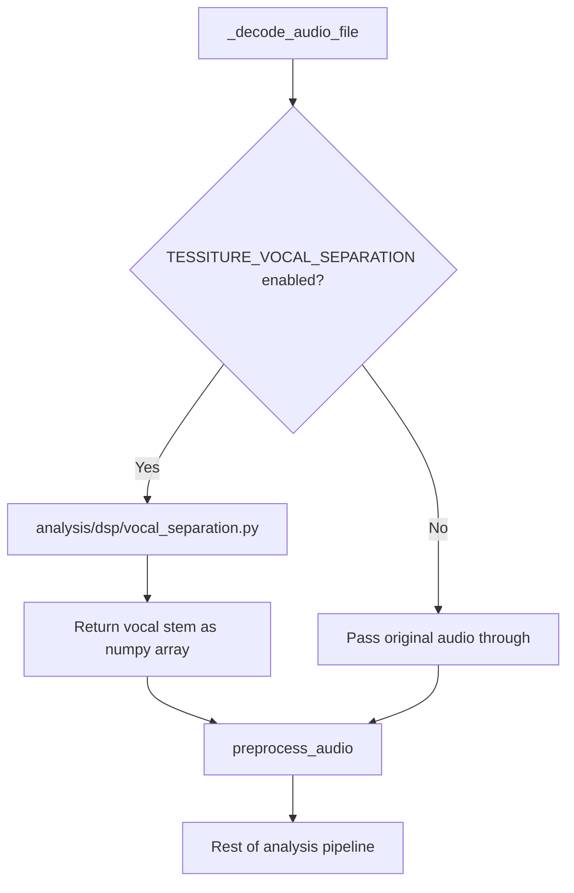
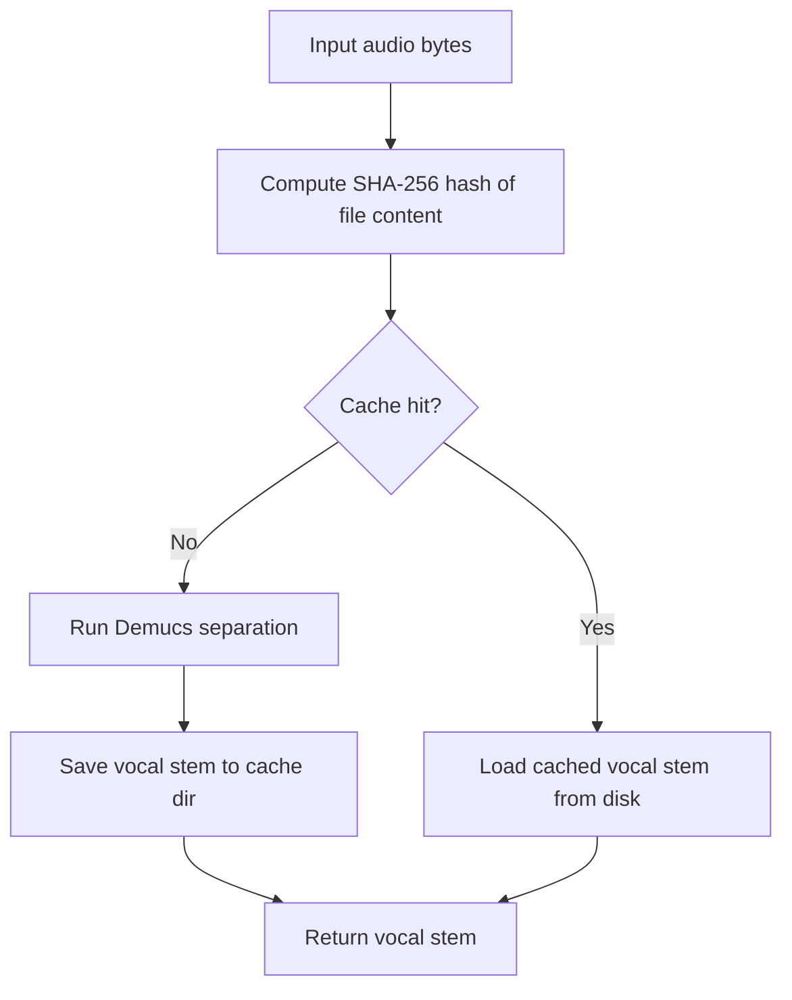

# Vocal Source Separation Plan

**Date:** 2026-03-04
**Scope:** Integrate Demucs-based vocal isolation into the analysis pipeline
**Triggered by:** Pitch range reporting mixed instrumental + vocal content as pitch range

---

## 1. Problem Statement

The analysis pipeline runs on full mixed audio. The pitch estimator tracks all harmonic content equally — bass lines, guitars, strings, synths — not just vocals. The reported "pitch range" in the summary reflects the extent of all pitched content in the mix, not the actual vocal range.

**Example:** "honey (demo)" reports a pitch range of 60-1574 Hz (B1-G6) after Phase 1 voicing filter, while the tessitura band (confidence-weighted 15th-85th percentile) reports C#2-G5. The true vocal range is likely much narrower, but instrumental content pollutes the extremes.

---

## 2. Chosen Solution: Demucs Source Separation

**Library:** [Demucs](https://github.com/facebookresearch/demucs) by Meta Research
**Model:** `htdemucs` — hybrid transformer model, state-of-the-art vocal separation
**License:** MIT
**Approach:** Separate vocals from accompaniment before running any pitch/tessitura analysis

### Why Demucs

- Best-in-class separation quality on musdb18 benchmark
- MIT license — no commercial restrictions
- PyTorch-based — native CUDA/GPU acceleration
- Actively maintained by Meta
- Produces clean vocal stems suitable for pitch tracking

### Trade-offs

| Aspect | Impact |
|--------|--------|
| Docker image size | +1.5-3 GB from PyTorch + model weights |
| Processing time with GPU | ~5-15s per 3-minute track |
| Processing time CPU-only | ~30-60s per 3-minute track |
| Memory usage | ~1-2 GB during separation |
| Dependency chain | torch, torchaudio, demucs |

---

## 3. Architecture

### 3.1 Pipeline Integration Point

Vocal separation inserts between audio decode and preprocessing:



### 3.2 New Module: analysis/dsp/vocal_separation.py

```
analysis/dsp/vocal_separation.py
├── SeparationResult dataclass
│   ├── vocals: np.ndarray
│   ├── sample_rate: int
│   ├── model_name: str
│   └── separation_time_s: float
├── _load_model -- lazy singleton, loads htdemucs once
├── separate_vocals -- main entry point
│   ├── Input: audio np.ndarray + sample_rate
│   ├── Converts to torch tensor
│   ├── Runs demucs separation
│   ├── Extracts vocals stem
│   └── Returns SeparationResult
└── is_available -- returns True if demucs+torch importable
```

### 3.3 Configuration

New environment variable with graceful fallback:

| Variable | Default | Values |
|----------|---------|--------|
| `TESSITURE_VOCAL_SEPARATION` | `auto` | `auto`, `on`, `off` |

- `auto`: Enable if demucs+torch are importable; disable gracefully otherwise
- `on`: Enable; raise error at startup if dependencies missing
- `off`: Disable entirely; use original mixed audio

### 3.4 Docker Image Changes

Switch from `python:3.11-slim` to NVIDIA CUDA base image:

```
FROM nvidia/cuda:12.1.1-runtime-ubuntu22.04 AS runtime
```

Install PyTorch with CUDA support + demucs in the runtime stage.

### 3.5 Docker Compose GPU Access

Add NVIDIA runtime to the tessiture service:

```yaml
services:
  tessiture:
    deploy:
      resources:
        reservations:
          devices:
            - driver: nvidia
              count: 1
              capabilities: [gpu]
```

### 3.6 Stem Cache Layer

Demucs separation is expensive even with GPU. A disk-based stem cache avoids re-separating the same track on repeated analyses.



**Design:**
- **Cache key**: SHA-256 hash of the raw uploaded file bytes
- **Cache storage**: Disk-based WAV files in a configurable directory
- **Cache dir**: `TESSITURE_STEM_CACHE_DIR`, defaults to `/data/stem_cache`
- **Cache format**: 16-bit PCM WAV at the original sample rate
- **Eviction**: None by default; manual cleanup or optional max-size LRU via `TESSITURE_STEM_CACHE_MAX_MB`
- **Thread safety**: File-level locking to prevent concurrent writes of the same stem
- **Persistence**: Survives server restarts; mounted as a Docker volume

**Config:**

| Variable | Default | Description |
|----------|---------|-------------|
| `TESSITURE_STEM_CACHE_DIR` | `/data/stem_cache` | Directory for cached vocal stems |
| `TESSITURE_STEM_CACHE_MAX_MB` | `0` | Max cache size in MB; 0 = unlimited |

---

## 4. Implementation Steps

### 4.1 Dependencies

Add to `requirements.txt`:
```
torch>=2.1.0
torchaudio>=2.1.0
demucs>=4.0.0
```

Consider a separate `requirements-gpu.txt` or extras to keep the base image optional.

### 4.2 Vocal Separation Module

Create `analysis/dsp/vocal_separation.py`:
- Lazy model loading with thread-safe singleton
- GPU detection and automatic device selection
- Mono downmix of the vocal stem output
- Error handling with graceful fallback to original audio
- Timing/logging for monitoring separation performance

### 4.3 Pipeline Integration

In `_run_analysis_pipeline` in `api/routes.py`:
- After `_decode_audio_file`, before `preprocess_audio`
- Conditional on `TESSITURE_VOCAL_SEPARATION` setting
- Compute file content hash for cache lookup
- Check stem cache; if hit, load cached vocal stem and skip separation
- If miss, run Demucs separation, save result to cache
- Report progress: add a "vocal_separation" stage to progress updates
- Log separation timing, cache hit/miss, and model info
- On failure: log warning, fall back to original audio, add to warnings list

### 4.4 Stem Cache Module

Create cache helpers in `analysis/dsp/vocal_separation.py`:
- `_cache_key(file_path)` — compute SHA-256 of file bytes
- `_cache_path(cache_dir, key)` — return `cache_dir / {key}.wav`
- `load_cached_stem(cache_dir, key)` — load WAV if exists, return ndarray or None
- `save_stem_to_cache(cache_dir, key, audio, sample_rate)` — write WAV with file lock
- Optional LRU eviction based on `TESSITURE_STEM_CACHE_MAX_MB`

### 4.4 Dockerfile

- Use multi-stage build: keep frontend-build stage as-is
- Switch runtime base from `python:3.11-slim` to `nvidia/cuda:12.1.1-runtime-ubuntu22.04`
- Install Python 3.11, pip, system deps
- Install PyTorch with CUDA index URL
- Install demucs
- Pre-download model weights during build so they are baked into the image

### 4.5 Docker Compose

- Add GPU reservation block
- Add `TESSITURE_VOCAL_SEPARATION` to environment section

### 4.7 Environment Config

- Add `TESSITURE_VOCAL_SEPARATION=auto` to `.env.unraid.example`
- Add `TESSITURE_STEM_CACHE_DIR=/data/stem_cache` to `.env.unraid.example`
- Add `TESSITURE_STEM_CACHE_MAX_MB=0` to `.env.unraid.example`

---

## 5. Testing Strategy

### 5.1 Unit Tests

`tests/test_analysis/test_vocal_separation.py`:
- Test `is_available` returns bool
- Test `separate_vocals` with a synthetic sine wave mix returns expected shape
- Test graceful fallback when demucs not importable
- Test model lazy loading is singleton
- Test stem cache write/read roundtrip
- Test cache hit returns identical audio to original separation
- Test cache miss triggers actual separation

### 5.2 Integration Tests

- Verify `_run_analysis_pipeline` calls separation when enabled
- Verify pipeline produces reasonable pitch range with separated audio
- Verify pipeline falls back gracefully when separation is disabled

### 5.3 End-to-End

- Re-analyze "honey (demo)" track on production after deploy
- Compare pitch range before/after separation
- Verify tessitura band is stable through the change

---

## 6. Rollback Plan

- Set `TESSITURE_VOCAL_SEPARATION=off` to instantly revert to mixed-audio analysis
- No schema changes; no API contract changes
- Separation is purely a preprocessing enhancement

---

## 7. Files Modified

| File | Change |
|------|--------|
| `analysis/dsp/vocal_separation.py` | **NEW** — Demucs wrapper + stem cache module |
| `analysis/dsp/__init__.py` | Export new module |
| `api/routes.py` | Insert separation call with cache lookup in pipeline |
| `requirements.txt` | Add torch, torchaudio, demucs |
| `Dockerfile` | CUDA base image, torch+demucs install, model pre-download |
| `deploy/unraid/docker-compose.yml` | GPU reservation, stem cache volume mount |
| `deploy/unraid/.env.unraid.example` | TESSITURE_VOCAL_SEPARATION, STEM_CACHE_DIR, STEM_CACHE_MAX_MB |
| `tests/test_analysis/test_vocal_separation.py` | **NEW** — Unit tests including cache tests |
| `plans/MASTER_IMPLEMENTATION_PLAN.md` | Mark vocal isolation as active |
